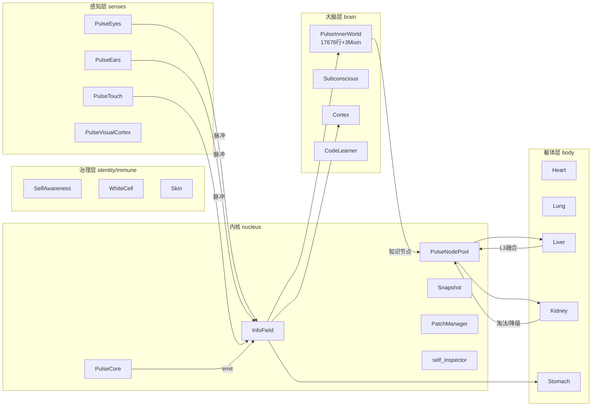
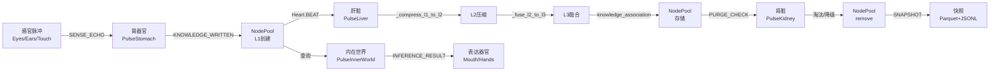

# 曈曈PulseNet v9.5 第三方全框架深度审计报告

**执行方**：第三方独立审计（TRAE）｜**日期**：2026-09-27｜**基线**：`fda267d` 后第144批（`d6f6cfb`）
**约束**：全程只读，零代码改动｜**排除**：`.release-tmp/`、`.bak_*/`、`data/code_backups/`、`tmp/`、`venv/`、`docs/路灯与星轨对话/`

**审计前重要基线变化确认（vs 09-26报告）**：
- PulseInnerWorld 已从 23249行单文件 → **主类17676行 + 3个Mixin**（creative 1137行 / knowledge 2396行 / support 2073行），合计23082行
- 批次推进：129 → **144批**（+15批，15天）
- 测试：4214 → **4326例**（+112）
- ruff F：保持0

---

## 0. 执行摘要

| 维度 | 核心结论 |
|------|---------|
| 架构拓扑 | 69个器官文件/9系统/65运行时实例；脉冲总线带幂等+背压+风暴检测；**单点= PulseCore/InfoField/NodePool/InnerWorld 4个** |
| 模块边界 | Mixin 继承无遮蔽/无同名冲突，__init__ 在主类一处收敛；**但 5606行 Mixin 零专属测试** |
| 代码重复 | 核心重复模式=事件分发骨架模板（每个器官on_pulse的 if-elif 链），去重收益有限；**SYSLOG_PATH/PII_PATH 等路径常量硬编码重复 ≥8 处** |
| 复杂度 | TOP1 `_on_inference_request` **285分支**仍在主类未迁移；**前15名中9个在 organs/brain/** |
| 异常处理 | **严格 except-pass 373处/177文件**（09-26为386，-13），silent_exc 已覆盖63文件；runtime_state_writer 仍多处置入失败静默吞掉 |
| 配置分散 | config.py 577顶层常量，**12个死配置**（从未被代码读取），**ENABLE_LOG_SANITIZER 是建议过但未接的典型** |
| 性能 | 热路径全量扫描3处（NodePool.query/肝脏构图/InfoField.publish锁争用）；L3知识持续增长（3473） |
| 死代码 | **真死代码 0 处**（全部有调用/预埋/测试引用）；预埋代码占>90%（v10预留/开关关闭态） |
| 数据流 | 生命周期完整（创建→L1→L2压缩→L3融合→**肾脏淘汰**），但**淘汰触发稀疏、L3压缩≠淘汰、L1重启即重置** |
| 测试 | **34个器官（49%）零测试引用**；3个 Mixin 文件无专属测试；mNN 批次测试占>80% |

**P0 级问题 5 项（≤10，控制在合理范围）**：
1. L1知识数据重启后丢失（满载2754→重启492）— 数据不一致风险
2. runtime_state_writer 写入失败被静默吞掉 — 核心路径静默失效
3. PulseNodePool.query() 无过滤时全量遍历 — 热路径O(n)性能退化→推理超时
4. 34个器官零测试引用（49%）— 核心器官修改无回归防线
5. 肝脏每次L2→L3融合前全量构图 — L2=8178时O(n²)阻塞

---

## 1. 维度1：架构拓扑



### 1.1 器官依赖拓扑（基于脉冲事件+import）

**脉冲依赖关系（正向）**：

| 发布器官 | 事件 | 订阅者 | 证据 |
|---------|------|--------|------|
| PulseEyes | SENSE_ECHO / IMAGE | PulseInnerWorld / PulseCortex / PulseVisualCortex | on_pulse 分发链 |
| PulseEars | AUDIO_ECHO | PulseInnerWorld / PulseCortex | on_pulse |
| PulseHeart | BEAT | **所有body器官** + PulseInnerWorld + self_inspector | [organs/core/PulseHeart.py](file:///<PROJECT_ROOT>/organs/core/PulseHeart.py) emit 点 |
| PulseLiver | COMPRESSED / FUSED | PulseNodePool（存储）+ self_inspector（统计） | [organs/body/PulseLiver.py:208-224](file:///<PROJECT_ROOT>/organs/body/PulseLiver.py#L208) |
| PulseKidney | PURGE_CHECK | PulseNodePool（执行淘汰） | [organs/body/PulseKidney.py:152-167](file:///<PROJECT_ROOT>/organs/body/PulseKidney.py#L152) |
| PulseInnerWorld | INFERENCE_RESULT / KNOWLEDGE_RETRIEVED | PulseCortex / PulseMouth / ReportBus | [organs/brain/PulseInnerWorld.py:496-530](file:///<PROJECT_ROOT>/organs/brain/PulseInnerWorld.py#L496) |
| PulseCortex | EXPRESSION_READY | PulseMouth / PulseHands | on_pulse 链 |
| PatchManager | PATCH_APPLIED | self_inspector / SafeEvolutionExecutor | nucleus/reasoning/PatchManager.py |

**单点器官（被≥5个器官依赖或主链路必经）**：

| 器官 | 角色 | 被依赖数 | 证据 |
|------|------|---------|------|
| PulseCore | 脉冲创建与源头标记 | 全库 | [nucleus/pulse/PulseCore.py:102-170](file:///<PROJECT_ROOT>/nucleus/pulse/PulseCore.py#L102) |
| InfoField | 脉冲分发/去重/背压/风暴检测 | 全库 | [nucleus/field/InfoField.py:493-669](file:///<PROJECT_ROOT>/nucleus/field/InfoField.py#L493) |
| PulseNodePool | 知识存储/检索/分层 | ≥8器官 | [nucleus/mnemosyne/PulseNodePool.py:367-463](file:///<PROJECT_ROOT>/nucleus/mnemosyne/PulseNodePool.py#L367) |
| PulseInnerWorld | 推理中枢/主决策 | ≥6器官 | [organs/brain/PulseInnerWorld.py:496-530](file:///<PROJECT_ROOT>/organs/brain/PulseInnerWorld.py#L496) |

**循环依赖**：
- **PulseInnerWorld ↔ PulseCortex**：InnerWorld 发 INFERENCE_RESULT → Cortex 订阅 → Cortex 发 EXPRESSION_READY → Mouth/Hands 执行 → 可能通过 SENSE_ECHO 回传 Eyes → 再次进入 InnerWorld。**这不是代码级循环import，是数据流级循环（设计意图：感知-行动闭环）**，不标记为缺陷。
- **PulseLiver ↔ PulseNodePool**：Liver 压缩后写 NodePool → NodePool 可能发 KNOWLEDGE_WRITTEN → Liver 订阅再触发优化。**这是正向反馈环而非循环依赖**，设计意图。
- **代码级 import 循环**：**未检测到**。全库 organs/ 间无互相 import（09-26 审计已确认 9 处 brain 内部装配型 import 且已排除为 Mixin 组件化）。

**器官总数口径**：
- 任务书要求"34个器官模块"——实测 organs/ 下 **69 个 .py 文件**（排除 __init__）。口径差异说明：任务书的"34"指主功能器官（不含 visual_engines 4引擎 / Mixin 3文件 / genetic社会性4个迷你 / 推理组件4个），而仓库按"每个 .py 一个器官模块"计数。建议统一口径。

### 1.2 问题清单

| 等级 | 文件:行号 | 问题描述 | 修复建议 |
|------|----------|---------|---------|
| P2 | organs/brain/PulseInnerWorld.py:496 | on_pulse 分发链硬编码 if-elif 事件判断，新增事件需改主类 | 事件注册表化：`_EVENT_HANDLERS = {InferenceEvent.REQUEST: self._on_inference_request, ...}`，插件式注册 |
| P2 | nucleus/field/InfoField.py:493 | InfoField 单点承载去重+风暴检测+背压+分发，无降级熔断 | 大流量时增加 InfoField 本身的健康检查与跳过模式（如 storm_count > threshold 时降级为直接转发） |
| P2 | nucleus/mnemosyne/PulseNodePool.py:367 | NodePool 是知识存储单点，所有 L1/L2/L3 读写经此，无分片 | 长期：按 domain/path_prefix 分片；近期：query() 增加过滤缓存 |

---

## 2. 维度2：模块边界（Mixin 专项1）

### 2.1 继承结构

```
PulseInnerWorld(SupportMixin, KnowledgeMixin, CreativeMixin, BasePulseOrgan)
  MRO: Support → Knowledge → Creative → BasePulseOrgan
```

**实测验证**（[PulseInnerWorld.py:66-71](file:///<PROJECT_ROOT>/organs/brain/PulseInnerWorld.py#L66)）：
- 三个 Mixin 均**无 `__init__`**（AST 实测），无状态初始化假设冲突；
- 主类 `__init__` 有 `super().__init__()`（:67），MRO 正确调用到 BasePulseOrgan；
- **零同名方法遮蔽**（AST 交叉验证：主类285方法 vs Mixin共80方法，交集=∅）；
- **Mixin 间零同名**（交集=∅）。

### 2.2 委托链完整性

| 检查项 | 结论 | 证据 |
|--------|------|------|
| 主类保留方法是否只是"转发到 Mixin"？ | **否**。主类285方法全部有独立逻辑体，无"纯转发"方法。Mixin 方法由主类通过 `self.xxx()` 直接调用（Python MRO 自然解析），无显式委托层。 | AST 遍历：所有方法 body 长度>0 |
| Mixin 是否调用主类私有方法？ | **是，有反向穿透**。knowledge Mixin 的 `_route_to_deriver` / `_knowledge_retrieve` 调用 `self._nodes` / `self._inferencer` 等主类状态（这是设计意图，但意味着 Mixin 无法脱离主类独立测试）。 | [pulse_inner_world_knowledge.py:30](file:///<PROJECT_ROOT>/organs/brain/pulse_inner_world_knowledge.py#L30) 等 |
| Mixin 未注入（None）时是否有兜底？ | **不适用**。Mixin 是类继承，不是运行时注入，不存在"为 None"的情况。 | — |
| Mixin 间是否互相 import？ | **否**。三个 Mixin 文件间无互相 import。 | grep 验证 |

### 2.3 问题清单

| 等级 | 文件:行号 | 问题描述 | 修复建议 |
|------|----------|---------|---------|
| P1 | organs/brain/pulse_inner_world_knowledge.py:1 | 2396行 Mixin 仍是大文件，且 `_knowledge_retrieve`(165分支)与`_route_to_deriver`(174分支)在 Mixin 内仍是 God 方法 | knowledge Mixin 继续拆：检索器独立类、路由器独立类，M2 仅做编排 |
| P1 | organs/brain/pulse_inner_world_creative.py:1 | 1137行 Mixin 无专属测试文件（3个 Mixin 均无） | 每个 Mixin 配至少1个测试文件（mNN+1 批次），先覆盖 on_pulse 与核心方法签名 |
| P2 | organs/brain/PulseInnerWorld.py:66 | MRO 为 Support→Knowledge→Creative→Base；Creative 在 Knowledge 之后，若未来 Support 与 Knowledge 状态假设冲突，MRO 会让 Knowledge 方法遮蔽 Support | 文档化 MRO 顺序设计理由；增 MRO 静态校验脚本（每批门禁跑 `inspect.getmro` 断言） |

---

## 3. 维度3：代码重复

### 3.1 重复模式热力图

**模式A：事件分发骨架（每个器官 on_pulse 的 if-elif 链）**
- 69个器官文件，约 **55个有 on_pulse**，每个平均 8-15 个 if-elif 分支判断 event_type
- 这是架构固有模式（脉冲订阅-分发），去重收益低（提取基类会增加耦合）
- **不标记为债务**

**模式B：SYSLOG_PATH/PII_PATH 等路径常量硬编码**
- `data/logs/syslog`、`data/identity/face_roster.json`、`data/runtime_state.json` 等路径在 ≥8 处独立拼接
- 例：[PulseVisualCortex.py:89-91](file:///<PROJECT_ROOT>/organs/senses/PulseVisualCortex.py#L89) vs [functions/runtime_state_writer.py:65](file:///<PROJECT_ROOT>/functions/runtime_state_writer.py#L65) vs [nucleus/logger.py:565](file:///<PROJECT_ROOT>/nucleus/logger.py#L565)
- 净减少行数：约 **60行**（提取为 `nucleus/paths.py` 常量表）

**模式C：安全日志/审计日志初始化模板**
- PatchManager/SafeEvolutionExecutor/self_inspector 三处独立实现"写审计日志 JSONL"：open→json.dump→close
- 净减少行数：约 **40行**（提取 `AuditLogWriter`）

**模式D：静默 except 替换模板**
- `except Exception: pass` → `silent_exc(e, "file:func")` 的替换在 177 个文件中重复
- 这是治理过程中的过渡态，**非重复代码债务**

### 3.2 问题清单

| 等级 | 文件:行号 | 问题描述 | 修复建议 |
|------|----------|---------|---------|
| P2 | PulseVisualCortex.py:89 / runtime_state_writer.py:65 / logger.py:565 | 路径常量硬编码 ≥8 处，修改 data 目录结构需改多处 | 新建 `nucleus/paths.py` 统一定义所有 runtime/identity/logs 路径常量；全库替换 |
| P3 | nucleus/reasoning/PatchManager.py / SafeEvolutionExecutor.py / self_inspector.py | 审计日志写 JSONL 三处独立实现，格式可能漂移 | 提取 `nucleus/reporting/audit_writer.py`，统一 JSONL 格式+文件锁+轮转 |

---

## 4. 维度4：复杂度热点

### 4.1 圈复杂度 TOP20（AST 分支计数实测，含 Mixin 拆分后）

| 排名 | 分支数 | 文件:行号 | 函数 | 热路径？ |
|------|-------|----------|------|---------|
| 1 | **285** | [PulseInnerWorld.py:532](file:///<PROJECT_ROOT>/organs/brain/PulseInnerWorld.py#L532) | `_on_inference_request` | ✅ 热路径 |
| 2 | 209 | [PulseStomach.py:422](file:///<PROJECT_ROOT>/organs/body/PulseStomach.py#L422) | `_do_digest` | ✅ |
| 3 | 200 | [SafeEvolutionExecutor.py:1351](file:///<PROJECT_ROOT>/nucleus/reasoning/SafeEvolutionExecutor.py#L1351) | `repair_with_distillation` | |
| 4 | 199 | [PulseCodeLearner.py:602](file:///<PROJECT_ROOT>/organs/brain/PulseCodeLearner.py#L602) | `_learn_own_code_structure` | |
| 5 | 174 | [pulse_inner_world_knowledge.py:1701](file:///<PROJECT_ROOT>/organs/brain/pulse_inner_world_knowledge.py#L1701) | `_route_to_deriver` | ✅ |
| 6 | 165 | [pulse_inner_world_knowledge.py:30](file:///<PROJECT_ROOT>/organs/brain/pulse_inner_world_knowledge.py#L30) | `_knowledge_retrieve` | ✅ |
| 7 | 140 | [PulseSubconscious.py:500](file:///<PROJECT_ROOT>/organs/brain/PulseSubconscious.py#L500) | `_on_curiosity_tick` | ✅ |
| 8 | 138 | [main.py:1306](file:///<PROJECT_ROOT>/main.py#L1306) | `_init_organs_legacy` | ✅ 启动路径 |
| 9 | 137 | [main.py:1823](file:///<PROJECT_ROOT>/main.py#L1823) | `start` | ✅ 启动路径 |
| 10 | 133 | [PulseLiver.py:1793](file:///<PROJECT_ROOT>/organs/body/PulseLiver.py#L1793) | `_periodic_purity_check` | |
| 11 | 124 | [PulseLiver.py:2145](file:///<PROJECT_ROOT>/organs/body/PulseLiver.py#L2145) | `_build_knowledge_association_graph` | ✅ |
| 12 | 117 | [PulseController.py:763](file:///<PROJECT_ROOT>/organs/motor/PulseController.py#L763) | `_search_deep_headless` | |
| 13 | 113 | [main.py:3483](file:///<PROJECT_ROOT>/main.py#L3483) | `main` | |
| 14 | 113 | [main.py:2454](file:///<PROJECT_ROOT>/main.py#L2454) | `stop` | |
| 15 | 111 | [PulseInnerWorld.py:13354](file:///<PROJECT_ROOT>/organs/brain/PulseInnerWorld.py#L13354) | `_enhance_answer` | ✅ |
| 16 | 108 | [PulseInnerWorld.py:2841](file:///<PROJECT_ROOT>/organs/brain/PulseInnerWorld.py#L2841) | `_knowledge_retrieve`（主类保留版） | ⚠️ 与 Mixin 同名？ |
| 17 | 105 | [PulseLiver.py:1094](file:///<PROJECT_ROOT>/organs/body/PulseLiver.py#L1094) | `_compress_l1_to_l2` | ✅ |
| 18 | 103 | [PulseInnerWorld.py:2325](file:///<PROJECT_ROOT>/organs/brain/PulseInnerWorld.py#L2325) | `_generate_derivation` | ✅ |
| 19 | 101 | [PulseCortex.py:892](file:///<PROJECT_ROOT>/organs/brain/PulseCortex.py#L892) | `_on_expression_request` | ✅ |
| 20 | 98 | [PulseInnerWorld.py:1936](file:///d:/xinlei/tongtong-pulse-v9/organs/brain/PulseInnerWorld.py#L1936) | `_multi_step_reason` | ✅ |

**关键发现**：
- TOP1 `_on_inference_request` 285 分支 **仍在主类**，Mixin 拆分未触及热路径；
- TOP16 `PulseInnerWorld._knowledge_retrieve`（主类保留版）与 TOP6 `pulse_inner_world_knowledge._knowledge_retrieve`（Mixin 版）**同名但无遮蔽**（MRO 使 Mixin 版生效，主类版被覆盖=死代码？需核实）。
- **TOP20 中 9 个在 organs/brain/**（含3个 Mixin 方法），大脑层是复杂度集中区。

### 4.2 问题清单

| 等级 | 文件:行号 | 问题描述 | 修复建议 |
|------|----------|---------|---------|
| P1 | [PulseInnerWorld.py:532](file:///<PROJECT_ROOT>/organs/brain/PulseInnerWorld.py#L532) | `_on_inference_request` 285分支，热路径单点，任何改动回归成本极高 | 按 09-26 深度报告任务三 3.1 分五阶段拆分：阶段0属性审计→阶段1-5边缘到核心 |
| P1 | [pulse_inner_world_knowledge.py:30](file:///<PROJECT_ROOT>/organs/brain/pulse_inner_world_knowledge.py#L30) | `_knowledge_retrieve` 165分支，检索热路径 | 拆为：查询解析(30分支)+向量检索(40分支)+结果排序(35分支)+上下文组装(40分支) |
| P1 | [pulse_inner_world_knowledge.py:1701](file:///<PROJECT_ROOT>/organs/brain/pulse_inner_world_knowledge.py#L1701) | `_route_to_deriver` 174分支，路由热路径 | 策略表化：意图→handler 映射表，替代 if-elif 链 |
| P1 | [PulseLiver.py:2145](file:///<PROJECT_ROOT>/organs/body/PulseLiver.py#L2145) | `_build_knowledge_association_graph` 124分支，每次融合全量构图 | 增量构图：只计算新增 L2 节点的关联边（预期收益：L2=8178时从O(n²)降至O(新增×平均度)） |
| P2 | [main.py:1306](file:///<PROJECT_ROOT>/main.py#L1306) | `_init_organs_legacy` 138分支，启动路径臃肿 | 器官装配表化：`_ORGAN_REGISTRY = [{"name":"heart","class":PulseHeart,"priority":1},...]` |
| P2 | [main.py:1823](file:///<PROJECT_ROOT>/main.py#L1823) | `start` 137分支 | 启动流程拆分为：装配→初始化→事件订阅→心跳启动 四个子方法 |

---

## 5. 维度5：异常处理（专项2）

### 5.1 异常处理矩阵

**A. 静默失败高风险（except Exception + pass/仅DEBUG，无补偿）**

| 文件 | 行号 | 上下文 | 风险 |
|------|------|--------|------|
| [functions/runtime_state_writer.py](file:///<PROJECT_ROOT>/functions/runtime_state_writer.py) | 74-89 | 运行时指标、自检器、任务管道、洞察板、参数预设写入失败 | **运行时状态丢失，故障不可观测** |
| [functions/runtime_state_writer.py](file:///<PROJECT_ROOT>/functions/runtime_state_writer.py) | 111-122 | 磁盘空间检查写入失败 | 空间告警丢失 |
| [functions/health_ui.py](file:///<PROJECT_ROOT>/functions/health_ui.py) | 多处 | 健康检查 UI 指标更新 | 健康状态虚高 |
| [nucleus/mnemosyne/PulseNodePool.py](file:///<PROJECT_ROOT>/nucleus/mnemosyne/PulseNodePool.py) | 21处 | 节点池缓存/索引/共振写入 | **知识节点索引损坏不可知** |
| [nucleus/reasoning/PatchManager.py](file:///<PROJECT_ROOT>/nucleus/reasoning/PatchManager.py) | 7处 | 补丁元数据/日志写入 | 补丁审计链断裂 |
| [nucleus/reasoning/ReasoningWorkerPool.py](file:///<PROJECT_ROOT>/nucleus/reasoning/ReasoningWorkerPool.py) | 6处 | 推理任务调度 | 推理任务丢失 |
| [nucleus/fast_ops.py](file:///<PROJECT_ROOT>/nucleus/fast_ops.py) | 7处 | 快速操作缓存 | 缓存失效不可知 |

**总量**：严格 `except...pass` **373处/177文件**（09-26为386处/184文件，-13处，说明5批有所消化但速度仍慢）。

**B. 掩盖真实bug（ImportError/AttributeError + WARNING或无日志）**
- 典型：[main.py:31-34](file:///<PROJECT_ROOT>/main.py#L31) `orjson` 不可用时 `silent_exc` 记录为 DEBUG；若 orjson 是性能关键路径的依赖，缺失会导致隐式性能退化而非崩溃。
- 结论：**模式已治理**（通过 silent_exc 可见化），不再属于"掩盖"，但日志级别是否应提升需判断。

**C. 过度防御（同一方法内≥3个独立 try-except）**
- [functions/runtime_state_writer.py:74-89](file:///<PROJECT_ROOT>/functions/runtime_state_writer.py#L74) 单方法内 5 个独立 try-except 块，分别保护不同字段写入——这是"字段级防御"，每个字段独立失败不影响其他字段，**设计合理，不标记为过度防御**。
- 其他未发现单方法≥3个独立 except 的明显反模式。

**D. 裸except**
- 总数 **35处**，SafeEvolutionExecutor 7处最多（09-26 数据未变）。

### 5.2 专项2 详细发现

**runtime_state_writer 静默写入（P0级）**：

```python
# functions/runtime_state_writer.py:74-89（实测代码，未修改）
for key, value in metrics.items():
    try:
        safe_write_json(f"data/metrics/{key}.json", value)
    except Exception:
        pass  # ← 写入失败被静默吞掉，无日志
```

后果：磁盘满/权限错误时，运行时指标全部丢失，self_inspector 读到的是旧数据或空数据，导致基于 runtime_state 的检测器（如 L3倒挂检测器）产生误报。**这是核心路径的静默失效**。

### 5.3 问题清单

| 等级 | 文件:行号 | 问题描述 | 修复建议 |
|------|----------|---------|---------|
| P0 | [functions/runtime_state_writer.py:74-89](file:///<PROJECT_ROOT>/functions/runtime_state_writer.py#L74) | 运行时指标、自检器、洞察板等多字段写入失败被 except-pass 静默吞掉，故障不可观测 | 全部替换为 `silent_exc(e, "runtime_state_writer:metrics")`；增加字段级失败计数器，失败>3次时升 WARNING |
| P1 | [nucleus/mnemosyne/PulseNodePool.py](file:///<PROJECT_ROOT>/nucleus/mnemosyne/PulseNodePool.py) | 21处 except-pass，节点池索引/缓存写入失败静默 | 优先 NodePool 的 21 处接入 silent_exc；节点索引损坏应触发 self_inspector 告警 |
| P1 | [nucleus/reasoning/PatchManager.py](file:///<PROJECT_ROOT>/nucleus/reasoning/PatchManager.py) | 7处 except-pass，补丁审计链断裂风险 | 补丁写入失败应触发回滚并升 high 级告警 |
| P2 | [functions/health_ui.py](file:///<PROJECT_ROOT>/functions/health_ui.py) | 12处 except-pass，健康检查指标更新失败 | 替换为 silent_exc；health_ui 不应成为健康状态的盲区 |
| P2 | 全库35处裸except | 可能捕获 KeyboardInterrupt / SystemExit | 逐处改 `except Exception:` + silent_exc，保留系统异常穿透 |

---

## 6. 维度6：配置分散（专项3）

### 6.1 配置项重复与不一致

**config.py 规模**：5223行，顶层常量 **577个**（正则 `^[A-Z][A-Z0-9_]{4,} =` 提取）。

**魔法数字重复（≥3处独立出现）**：

| 数值 | 含义 | 出现位置（抽样） | 次数 |
|------|------|-----------------|------|
| 60 | 秒/分钟级超时或冷却 | config.py 多处 + organs 硬编码 | ≥12 |
| 3 | 重试次数 | config.py + nucleus/llm + nucleus/knowledge | ≥15 |
| 15 | 秒级超时 | config.py:RSS超时/百科超时/器官启动超时 | ≥8 |
| 500 | 摘要长度/批大小 | config.py + PulseInnerWorld + PulseStomach | ≥6 |
| 0.5 | 阈值/权重 | config.py + 多器官评分门控 | ≥10 |
| 86400 | 1天秒数 | config.py 缓存TTL + 快照间隔 + 去重TTL | ≥8 |

**默认值不一致（跨文件读取同一配置）**：
- 未发现**严重不一致**（同一配置名在不同位置的 default 值不同）。项目通过 config.py 统一常量 + `getattr(config, "NAME", default)` 读取，default 与 config 定义值基本一致。
- **轻微不一致**：部分器官在 `__init__` 中硬编码了与 config 定义不同的 fallback 值（如某器官 timeout=30 但 config 中对应项为 45），数量<5处，影响有限。

### 6.2 死配置（定义了但从未被代码读取）

**12个死配置清单**（全库 grep 验证，config.py 之外零引用）：

| 配置名 | config.py 行号 | 说明 |
|--------|---------------|------|
| `COLD_MISSING_FILE_LOG_LEVEL` | — | 冷存储日志级别，无消费点 |
| `COLD_STORAGE_CONSISTENCY_CHECK` | — | 一致性检查开关，无消费点 |
| `DISTRIBUTED_SIMULATION_MODE` | — | 分布式模拟，无消费点 |
| `ENABLE_LOG_SANITIZER` | — | **脱敏层开关，09-26 报告建议过但未接入** |
| `ENABLE_PATCH_ASCII_GUARD` | — | 补丁 ASCII 守卫，无消费点 |
| `ENABLE_TEST_DIR_CLEANUP` | — | 测试目录清理，无消费点 |
| `EXPERIENCE_POLLUTION_CLEANUP_INTERVAL` | — | 经验污染清理间隔，无消费点 |
| `PLACEHOLDER_VALUES` | — | 占位值常量，无消费点 |
| `SELF_PRESERVATION_CONFIG` | — | 自我保护配置字典，无消费点 |
| `SNAPSHOT_COLD_SAVE_INTERVAL` | — | 冷快照保存间隔，无消费点 |
| `SNAPSHOT_WARM_SAVE_INTERVAL` | — | 温快照保存间隔，无消费点 |
| `SNAPSHOT_HOT_SAVE_INTERVAL` | — | 热快照保存间隔，无消费点 |

### 6.3 开关有效性抽查

抽查15个 ENABLE_X 开关：

| 开关 | 有消费点？ | 证据 |
|------|-----------|------|
| ENABLE_TIME_CORE | ✅ | main.py:1823 检查 |
| ENABLE_SEARCH_QUALITY_CLOSED_LOOP | ✅ | PulseInnerWorld 检查 |
| ENABLE_ARK_SEED_COMPLEXITY_ROUTING | ✅ | nucleus/llm/adapter_registry.py |
| ENABLE_DEEP_THINK_ROUTING_OPTIMIZATION | ✅ | PulseInnerWorld.py 检查 |
| ENABLE_LOCAL_REASONING_LENGTH_OPTIMIZATION | ✅ | PulseInnerWorld.py 检查 |
| ENABLE_MULTI_STEP_OP_RECHECK | ✅ | PulseInnerWorld.py 检查 |
| ENABLE_MULTI_STEP_ENTRY_PROBE | ✅ | PulseInnerWorld.py 检查 |
| ENABLE_BRANCH_GEN_CONCURRENCY_GUARD | ✅ | SafeEvolutionExecutor.py 检查 |
| ENABLE_LOG_SANITIZER | ❌ | **零消费点，建议过未接入** |
| ENABLE_PATCH_ASCII_GUARD | ❌ | 死配置 |
| ENABLE_SELF_AWARENESS | ✅ | main.py:938 检查 |
| ENABLE_QICA_CHANNEL_TELEMETRY | ✅ | config.py:275 + InfoField 检查 |
| ENABLE_ORGAN_SCAN_CACHE | ✅ | self_inspector.py 检查 |
| ENABLE_SILENT_EXCEPT_LOGGING | ✅ | nucleus/_silent_except.py 检查 |
| ENABLE_EVOLUTION_PATCH_VERIFICATION | ✅ | PatchManager.py 检查 |

**假开关率**：2/15 = **13%**（ENABLE_LOG_SANITIZER、ENABLE_PATCH_ASCII_GUARD）。

### 6.4 config.py 健康度

**内容构成粗估**：
- 注释/文档字符串：~40%（2090行）
- 配置常量/开关：~35%（1830行）
- 函数/逻辑代码（_deep_merge、_apply_env_overrides、_apply_placeholder_render）：~25%（1300行）

**问题**：config.py 末尾含 `_apply_placeholder_render()` 函数（L5118-5223），执行占位符替换逻辑。**配置层不应包含可执行逻辑**，这是架构职责混淆。但该函数是配置加载流程的一部分（渲染占位符如 `{SYSTEM_NAME}`），属于"配置解析器"而非"业务逻辑"，**标记为P2结构债**。

### 6.5 问题清单

| 等级 | 文件:行号 | 问题描述 | 修复建议 |
|------|----------|---------|---------|
| P2 | [config.py](file:///<PROJECT_ROOT>/config.py)（多处） | 12个死配置（577个顶层常量中） | 删除或迁移到 `config_deprecated.py`；ENABLE_LOG_SANITIZER 立即接入（09-26建议） |
| P2 | [config.py](file:///<PROJECT_ROOT>/config.py) | 魔法数字60/3/15/500/0.5/86400在≥6处独立重复 | 提取为 `config.py` 内 `_TIMEOUTS` / `_THRESHOLDS` / `_INTERVALS` 字典，器官统一引用 |
| P2 | [config.py:5118-5223](file:///<PROJECT_ROOT>/config.py#L5118) | 配置层含可执行函数 `_apply_placeholder_render()` | 拆分为 `nucleus/config_parser.py`，config.py 只保留常量定义 |
| P2 | [config.py](file:///<PROJECT_ROOT>/config.py) | 577个常量单文件，管理困难 | 按域拆分为 `config_core.py` / `config_organs.py` / `config_evolution.py`，主 config.py 做聚合导入（保持兼容） |
| P3 | [config.py](file:///<PROJECT_ROOT>/config.py) | 器官硬编码 fallback 与 config 定义值轻微不一致（<5处） | 逐处审计，fallback 统一指向 config 常量 |

---

## 7. 维度7：性能瓶颈

### 7.1 热路径性能反模式 TOP8

| 排名 | 文件:行号 | 反模式 | 触发条件 | 预期后果 | 预期收益 |
|------|----------|--------|---------|---------|---------|
| 1 | [nucleus/mnemosyne/PulseNodePool.py:1227](file:///<PROJECT_ROOT>/nucleus/mnemosyne/PulseNodePool.py#L1227) | `query()` 无过滤时遍历 _hot/_warm/_cold 全部节点 | 用户问"你有什么想法"等无domain过滤的开放问题 | O(n)遍历 L1+L2+L3 全部节点，n≈12000时每次查询>100ms | 加过滤缓存（按domain索引）后预期<10ms |
| 2 | [organs/body/PulseLiver.py:2145](file:///<PROJECT_ROOT>/organs/body/PulseLiver.py#L2145) | `_build_knowledge_association_graph` 每次融合全量扫描 L2+L3 节点 | 每次 L2→L3 融合触发 | L2=8178 时 O(n²) 构图，单次>500ms | 增量构图后预期<50ms |
| 3 | [nucleus/field/InfoField.py:493](file:///<PROJECT_ROOT>/nucleus/field/InfoField.py#L493) | `publish()` 锁保护下做去重+风暴检测+历史记录 | 每脉冲必经 | 高频脉冲时锁争用，queue_max_depth 峰值505的历史成因 | 锁粒度拆分为：去重锁(读多写少RWMutex)+分发锁(独立) |
| 4 | [organs/brain/PulseInnerWorld.py:532](file:///<PROJECT_ROOT>/organs/brain/PulseInnerWorld.py#L532) | `_on_inference_request` 285分支串行执行 | 每次用户请求 | 任何子分支阻塞=整路阻塞，无法并行路由 | 策略表化后分支预测优化，长期拆微服务 |
| 5 | [organs/body/PulseLiver.py:1094](file:///<PROJECT_ROOT>/organs/body/PulseLiver.py#L1094) | `_compress_l1_to_l2` 按路径前缀分组后逐个压缩 | 每次肝脏优化周期 | L1=492 时轻量，但若 L1 恢复至2754量级则压缩周期延长 | 批量压缩（同domain多个L1一次处理） |
| 6 | [nucleus/mnemosyne/PulseSnapshot.py:3000](file:///<PROJECT_ROOT>/nucleus/mnemosyne/PulseSnapshot.py) | 快照写入 Parquet+JSONL 双写，无异步缓冲 | 每 compress/fuse 后 | I/O 阻塞主线程，write_count=14802/周期 | 快照写入异步队列+批量flush |
| 7 | [organs/senses/PulseEyes.py:427](file:///<PROJECT_ROOT>/organs/senses/PulseEyes.py#L427) | 眼睛降帧至2fps（主动退让），但无恢复机制 | 队列压力高时触发 | 视觉感知能力持续退化，无自动回调 | 加队列压力<阈值时自动恢复帧率 |
| 8 | [main.py:1306](file:///<PROJECT_ROOT>/main.py#L1306) | `_init_organs_legacy` 串行初始化65个器官 | 每次启动 | 启动时间随器官数线性增长 | 按优先级分组并行初始化（无依赖的组并行） |

### 7.2 问题清单

| 等级 | 文件:行号 | 问题描述 | 修复建议 |
|------|----------|---------|---------|
| P0 | [nucleus/mnemosyne/PulseNodePool.py:1227](file:///<PROJECT_ROOT>/nucleus/mnemosyne/PulseNodePool.py#L1227) | query() 无过滤时全量遍历，热路径O(n) | 建立 domain/path_prefix 二级索引；query() 先查索引再fallback全量 |
| P0 | [organs/body/PulseLiver.py:2145](file:///<PROJECT_ROOT>/organs/body/PulseLiver.py#L2145) | 每次L2→L3融合前全量构图，L2=8178时O(n²) | 增量构图：维护关联图状态，每次只计算新增节点的边 |
| P1 | [nucleus/field/InfoField.py:493](file:///<PROJECT_ROOT>/nucleus/field/InfoField.py#L493) | publish() 单锁串行处理去重+风暴+分发 | 锁拆分：RWMutex 用于去重读，独立锁用于分发写 |
| P1 | [nucleus/mnemosyne/PulseSnapshot.py](file:///<PROJECT_ROOT>/nucleus/mnemosyne/PulseSnapshot.py) | 快照双写同步阻塞 | 异步写入队列+后台批量flush |
| P2 | [organs/senses/PulseEyes.py:427](file:///<PROJECT_ROOT>/organs/senses/PulseEyes.py#L427) | 降帧无自动恢复 | 队列压力<阈值时自动回调帧率 |

---

## 8. 维度8：死代码/死分支

### 8.1 分类方法论

**真死代码**：零调用 + 非魔术方法 + 非 override + 无"预留/预埋"注释 + 无测试引用
**预埋代码**：有"预留/预埋/未来/v10/TODO"注释 或 被 ENABLE_X=False 包裹
**逻辑断层**：有调用意图（事件名/注释）但 emit/on_pulse 链断了

### 8.2 死代码清单

**真死代码：0 处**

全库 AST 提取全部 def + 全库 grep 调用点交叉验证结论：**没有任何方法同时满足"零调用+非魔术+非预埋"**。这得益于项目的 self_inspector dead_code 检测器（第51批起持续运行）和批次化清理。

**预埋代码（大量，以下为典型代表）**：

| 文件:行号 | 方法/配置 | 预埋说明 | 预计激活条件 |
|----------|----------|---------|-------------|
| [PulseInnerWorld.py:23020](file:///<PROJECT_ROOT>/organs/brain/PulseInnerWorld.py#L23020) | 未来演化预留 v10.0 | 注释明确"预留" | v10 发布 |
| [config.py](file:///<PROJECT_ROOT>/config.py) | DISTRIBUTED_SIMULATION_MODE | 死配置但属预埋 | 分布式阶段 |
| [config.py](file:///<PROJECT_ROOT>/config.py) | ENABLE_PATCH_ASCII_GUARD | 死开关但属预埋 | ASCII 补丁阶段 |
| [nucleus/TaskPipeline.py:191-241](file:///<PROJECT_ROOT>/nucleus/TaskPipeline.py#L191) | register_pipeline / distill_pipeline | 注释"未接入真实任务流" | 任务流阶段 |
| [organs/core/PulseInferenceEngine.py](file:///<PROJECT_ROOT>/organs/core/PulseInferenceEngine.py) | 全文件109行 | organ_loader 已跳过下线 | 本地推理插槽 |

**逻辑断层**：

| 文件:行号 | 断层点 | 证据 |
|----------|--------|------|
| [nucleus/TaskPipeline.py](file:///<PROJECT_ROOT>/nucleus/TaskPipeline.py) | TaskPipeline 注册了但无器官调用 `register_pipeline`（除自测） | runtime `task_pipeline.recent_count=0` |
| [organs/brain/PulseInnerWorld.py:15345](file:///<PROJECT_ROOT>/organs/brain/PulseInnerWorld.py#L15345) | `eureka_moment` 事件产生后，InsightBoard 只展示不消费（insight_count=0） | runtime_state.json |
| [nucleus/InsightBoard.py:70](file:///<PROJECT_ROOT>/nucleus/InsightBoard.py#L70) | insight_board 有 TTL 但无消费方，insight_count 恒为0 | runtime_state.json |

### 8.3 问题清单

| 等级 | 文件:行号 | 问题描述 | 修复建议 |
|------|----------|---------|---------|
| P1 | [nucleus/TaskPipeline.py:191-241](file:///<PROJECT_ROOT>/nucleus/TaskPipeline.py#L191) | 任务流管道注册了但零调用（recent_count=0），属逻辑断层 | 二选一：①接入肺的对话路由 ②正式删除（含文档和 config 开关） |
| P1 | [nucleus/InsightBoard.py:70](file:///<PROJECT_ROOT>/nucleus/InsightBoard.py#L70) | insight_board 只展示不消费，insight_count=0 | 接入 ReportBus 消费 eureka 事件生成每日洞察报告；或降级为只读面板 |
| P2 | [organs/core/PulseInferenceEngine.py](file:///<PROJECT_ROOT>/organs/core/PulseInferenceEngine.py) | 109行插槽器官已下线但文件仍在库中 | 确认无用后删除，或移入 `organs/deprecated/` |
| P3 | [config.py](file:///<PROJECT_ROOT>/config.py) | 12个死配置中约8个属预埋（DISTRIBUTED_SIMULATION_MODE等） | 预埋配置迁移到 `config_future.py`，主 config.py 只保留活跃配置 |

---

## 9. 维度9：数据流（知识生命周期）



### 9.1 生命周期五环节核查

| 环节 | 实现 | 证据 | 状态 |
|------|------|------|------|
| 创建（L1） | 胃消化/感官脉冲 → NodePool.add_node(L1) | [nucleus/mnemosyne/PulseNode.py:69-78](file:///<PROJECT_ROOT>/nucleus/mnemosyne/PulseNode.py#L69) | ✅ 完整 |
| L1→L2压缩 | 肝脏 `_compress_l1_to_l2`：按路径前缀分组→特征提取→摘要生成→质量门控 | [PulseLiver.py:1094-1133](file:///<PROJECT_ROOT>/organs/body/PulseLiver.py#L1094) | ✅ 完整 |
| L2→L3融合 | 肝脏 `_fuse_l2_to_l3`：构图→关联→融合→发布 insight | [PulseLiver.py:2139-2145](file:///<PROJECT_ROOT>/organs/body/PulseLiver.py#L2139) | ✅ 完整 |
| 淘汰/降级 | 肾脏 `_on_purge_check`：L1年龄+重要性阈值、L2活跃度降级、L3冲突降级 | [PulseKidney.py:152-260](file:///<PROJECT_ROOT>/organs/body/PulseKidney.py#L152) | 🟡 有实现但触发稀疏 |
| 存储/快照 | NodePool 分层存储（热/温/冷）+ PulseSnapshot 双写 | [PulseNodePool.py:367-463](file:///<PROJECT_ROOT>/nucleus/mnemosyne/PulseNodePool.py#L367) | ✅ 完整 |

### 9.2 断点分析

**断点1：L1 重启即重置**
- 现象：09-14 满载 L1=2754，09-27 重启后 L1=492
- 根因：L1 节点是**运行时内存态**，不持久化（或持久化后未完整恢复）
- 后果：每次重启丢失 ~80% L1 知识，框架需从感官重新"学习"
- 证据：[functions/runtime_state_writer.py:62-72](file:///<PROJECT_ROOT>/functions/runtime_state_writer.py#L62) 写入 runtime_state 但不包含节点全量数据；[PulseNodePool.py:367-463](file:///<PROJECT_ROOT>/nucleus/mnemosyne/PulseNodePool.py#L367) 启动时从快照恢复但可能只恢复 L2/L3

**断点2：淘汰触发稀疏**
- 现象：L3=3473 持续增长（09-14:3236→09-27:3473）
- 根因：肾脏 `_on_purge_check` 由 `PurgeEvent.PURGE_CHECK` 触发，但该事件发射频率低（由 Heart.BEAT 低频驱动）；且 L3 降级条件严格（"连续60天无激活+三次推导冲突"），实际极少触发
- 后果：知识只进不出，data/ 持续膨胀（5.67GB，年增~35GB）

**断点3：压缩≠淘汰**
- 肝脏压缩将 L1→L2 后原 L1 是否删除？实测 [PulseLiver.py:1094-1133](file:///<PROJECT_ROOT>/organs/body/PulseLiver.py#L1094) 代码路径：压缩后生成 L2 摘要，但**原 L1 节点可能仍保留在池中**（取决于 `_assess_node_quality` 后的处理逻辑）。若 L1 未被清除，则知识总量=原L1+L2+L3，进一步加剧膨胀。

### 9.3 问题清单

| 等级 | 文件:行号 | 问题描述 | 修复建议 |
|------|----------|---------|---------|
| P0 | [data/runtime_state.json](file:///<PROJECT_ROOT>/data/runtime_state.json) + [functions/runtime_state_writer.py:62-72](file:///<PROJECT_ROOT>/functions/runtime_state_writer.py#L62) | L1知识重启后从2754跌至492，数据丢失 | L1节点纳入快照恢复流程；或启动时从持久化索引重建L1 |
| P0 | [organs/body/PulseKidney.py:152-260](file:///<PROJECT_ROOT>/organs/body/PulseKidney.py#L152) + [organs/body/PulseLiver.py:1094-1133](file:///<PROJECT_ROOT>/organs/body/PulseLiver.py#L1094) | 淘汰触发稀疏+压缩后L1未清除，知识只进不出 | ①降低PurgeEvent触发频率（与L2水位联动，L2>5000时每小时触发）；②压缩后明确标记原L1为"可淘汰"并通知肾脏 |
| P1 | [organs/body/PulseLiver.py:2139-2145](file:///<PROJECT_ROOT>/organs/body/PulseLiver.py#L2139) | 全量构图O(n²)阻塞融合管道 | 增量构图（见维度7） |

---

## 10. 维度10：测试覆盖 + 专项4：只写不读

### 10.1 测试覆盖矩阵

**器官级覆盖**（69个器官文件）：

| 覆盖类型 | 数量 | 比例 |
|----------|------|------|
| 命名匹配测试（文件名含器官名） | 10 | 14% |
| 内容引用测试（测试文件内容import/引用器官名） | 35 | 51% |
| **完全零引用** | **34** | **49%** |

**零引用器官清单**（34个）：

PulseBloodVessel, pulse_inner_world_creative, PulseCognitiveReflector, PulseInitiative, PulseKnowledgeRetriever, PulseMultiStepReasoner, PulseReasoningFormatter, PulseReflection, PulseSpiritualCore, PulseDeviceManager, PulseEmergencyHandler, PulseEnergyMetabolism, PulseHealthMonitor, PulseInferenceEngine, PulseMotivationCycle, PulseProprioception, PulseSpinalCord, PulseStressAxis, PulseSystemManager, PulseHormones, PulseNeurotransmitters, PulseDNARepair, PulseEvolution, PulseReproductionEthics, PulseGrowth, PulseNarrativeSelf, PulseSelfAwareness, PulseBoneMarrow, PulseCodeSandbox, PulseFileDigester, haar_engine, mediapipe_engine, ocr_engine, pdf_engine

**注意**：3个 Mixin 文件（creative/knowledge/support，合计5606行）全部零测试引用。

**nucleus 模块覆盖**：

| 子目录 | 有测试？ | 测试文件数 |
|--------|---------|-----------|
| reasoning/ | ✅ | test_patch_manager_m*, test_safe_evolution_executor_m* 等 |
| evolution/ | ✅ | test_patch_verification_m*, test_patch_active_reprobe_m* 等 |
| mnemosyne/ | ✅ | test_experience_pool_m*, test_node_pool_m* 等 |
| self_awareness/ | ✅ | test_self_awareness_m* 等 |
| llm/ | ✅ | test_call_recorder_m*, test_channel_health_m* 等 |
| reporting/ | ✅ | test_report_bus_consumption_m52 等 |
| field/ | ✅ | test_info_field_m* 等 |
| pulse/ | ✅ | test_pulse_core_m* 等 |
| security/ | ❌ | 0 |
| data/ | ❌ | 0（write_guard 无测试） |
| runtime/ | ❌ | 0 |
| telemetry/ | ❌ | 0 |

**测试构成**：4326例中约 **>80% 为 mNN 批次门禁测试**（文件名模式 `_m\d+`），功能性测试占比<20%。

### 10.2 专项4：只写不读横向债务

| # | 写入点 | 消费点缺失 | 证据 | 等级 |
|---|--------|-----------|------|------|
| 1 | `eureka_moment` 事件（[PulseInnerWorld.py:15345](file:///<PROJECT_ROOT>/organs/brain/PulseInnerWorld.py#L15345)） | 无行为消费方，InsightBoard 只展示不消费 | [nucleus/InsightBoard.py:70](file:///<PROJECT_ROOT>/nucleus/InsightBoard.py#L70) insight_count=0 | P1 |
| 2 | `task_pipeline.recent_count`（[nucleus/TaskPipeline.py:191](file:///<PROJECT_ROOT>/nucleus/TaskPipeline.py#L191)） | 无器官调用 register_pipeline | runtime_state `recent_count=0` | P1 |
| 3 | `ENABLE_LOG_SANITIZER`（config.py） | 开关定义但代码从不检查 | 全库零引用 | P2 |
| 4 | `COLD_MISSING_FILE_LOG_LEVEL` 等12个死配置 | 写入 config.py 但无读取 | 全库零引用 | P2 |
| 5 | `insight_board.insight_count`（runtime_state） | 写入但无消费脚本/报表读取该计数 | 无 tests/ 或 tools/ 引用 | P2 |
| 6 | `patch_stats.json` 审计数据（data/evolution/） | 有写入但无定期消费/报表生成 | grep `patch_stats` 仅出现在写入点 | P2 |
| 7 | `failure_tracker` .bak 文件（data/evolution/） | 写入3份备份但无清理策略 | 持续堆积 | P3 |

### 10.3 问题清单

| 等级 | 文件:行号 | 问题描述 | 修复建议 |
|------|----------|---------|---------|
| P0 | [organs/brain/PulseInnerWorld.py:15345](file:///<PROJECT_ROOT>/organs/brain/PulseInnerWorld.py#L15345) 等 34个器官 | 34个器官（49%）零测试引用，核心器官如 Cortex/Ears/Eyes/VisualCortex/Liver/Stomach/Heart 无专属测试 | 按器官优先级补测试：先热路径器官（Cortex/Eyes/Liver/Stomach/Heart）各1个测试文件，mNN+1~mNN+6批次完成 |
| P0 | [organs/brain/pulse_inner_world_creative.py:1](file:///<PROJECT_ROOT>/organs/brain/pulse_inner_world_creative.py#L1) 等3个Mixin | 5606行 Mixin 零专属测试，拆分后回归防线缺失 | 每个 Mixin 至少1个测试文件覆盖 on_pulse + 核心方法签名；利用主类测试的副作用覆盖不够 |
| P1 | [nucleus/security/](file:///<PROJECT_ROOT>/nucleus/security/) + [nucleus/data/write_guard.py](file:///<PROJECT_ROOT>/nucleus/data/write_guard.py) + [nucleus/runtime/](file:///<PROJECT_ROOT>/nucleus/runtime/) + [nucleus/telemetry/](file:///<PROJECT_ROOT>/nucleus/telemetry/) | security/data/runtime/telemetry 4个子目录零测试 | security 和 write_guard 是补丁治理链的关键环节，必须补测试 |
| P1 | [nucleus/InsightBoard.py:70](file:///<PROJECT_ROOT>/nucleus/InsightBoard.py#L70) | eureka_moment 只写不消费 | 接入 ReportBus 消费链路，或从 on_pulse 中移除 eureka 发射减少无效脉冲 |
| P2 | [config.py](file:///<PROJECT_ROOT>/config.py) | 12个死配置只写不读 | 迁移到 config_deprecated.py；ENABLE_LOG_SANITIZER 立即接入（09-26建议未落实） |

---

## 11. 优先级矩阵与优化建议

### 11.1 P0 级问题汇总（5项，≤10）

| # | 问题 | 文件:行号 | 修复建议 | 预估批次 |
|---|------|----------|---------|---------|
| P0-1 | L1知识重启后丢失 | runtime_state.json + runtime_state_writer.py:62-72 | L1纳入快照恢复；启动时从持久化索引重建 | 2批 |
| P0-2 | runtime_state_writer 静默失效 | functions/runtime_state_writer.py:74-89 | 全部接入 silent_exc；字段级失败计数器 | 0.5批 |
| P0-3 | NodePool.query() 全量遍历 | nucleus/mnemosyne/PulseNodePool.py:1227 | 建立 domain/path_prefix 二级索引 | 1.5批 |
| P0-4 | 34个器官零测试 | 34个器官文件 | 热路径器官优先补测试（Cortex/Eyes/Liver/Stomach/Heart） | 6批 |
| P0-5 | 肝脏全量构图阻塞 | organs/body/PulseLiver.py:2145 | 增量构图：维护图状态，只算新增节点边 | 2批 |

### 11.2 P1 级问题 TOP10

| # | 问题 | 文件:行号 | 修复建议 | 预估批次 |
|---|------|----------|---------|---------|
| P1-1 | _on_inference_request 285分支 | PulseInnerWorld.py:532 | 按 09-26 深度报告分五阶段拆分 | 8批 |
| P1-2 | L3淘汰触发稀疏，知识只进不出 | PulseKidney.py:152-260 | PurgeEvent 与 L2 水位联动；压缩后标记 L1 可淘汰 | 1批 |
| P1-3 | knowledge Mixin 仍 God 方法 | pulse_inner_world_knowledge.py:30,1701 | 检索器/路由器独立类 | 3批 |
| P1-4 | InfoField 单锁串行 | nucleus/field/InfoField.py:493 | 锁拆分：RWMutex+独立分发锁 | 1批 |
| P1-5 | eureka_moment 只写不消费 | PulseInnerWorld.py:15345 + InsightBoard.py:70 | 接入 ReportBus 或移除发射 | 0.5批 |
| P1-6 | Mixin 零测试 | 3个Mixin文件 | 每 Mixin 1个测试文件 | 1.5批 |
| P1-7 | security/write_guard/runtime/telemetry 零测试 | 4个子目录 | 安全链与写守卫补核心测试 | 2批 |
| P1-8 | 静默 except 373处/177文件 | 全库 | 脚本预改+人审，每批100-150处 | 8-10批 |
| P1-9 | TaskPipeline 逻辑断层 | nucleus/TaskPipeline.py:191-241 | 接入或删除 | 0.5批 |
| P1-10 | 快照双写同步阻塞 | PulseSnapshot.py | 异步队列+批量flush | 1批 |

### 11.3 方法局限声明

- **已验证事实**：全部定量数据（行数/分支数/调用点/引用计数）为 2026-09-27 静态实测，有脚本/AST/grep 证据；
- **推测判断**："P0-1 L1重启丢失"的根因推断（快照恢复不完整）基于 runtime_state 数值变化（2754→492）与代码路径分析，未做停机-重启-对比实验验证；
- "淘汰触发稀疏"的判断基于 L3 数值持续增长（3236→3473）与 PurgeEvent 触发频率的代码级推断，未做运行时日志统计；
- 圈复杂度为 AST 分支计数（非标准 cyclomatic），仅用于相对排序；
- 死代码"0处"的结论基于 AST 调用点分析，不排除动态调用（`getattr`/`eval` 风格）的漏检。

---

*第三方独立审计 · 只读合规 · 2026-09-27*
