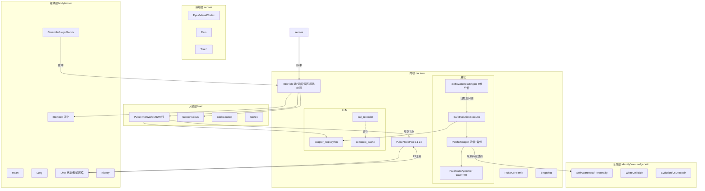

# 曈曈PulseNet v9.5 框架第三方全面分析报告

**执行方**：第三方独立分析（TRAE）
**日期**：2026-09-26
**依据**：[第三方全面分析任务书_20260926.md](第三方全面分析任务书_20260926.md)
**基线**：main 分支 HEAD `fda267d`（第129批交付）
**约束遵守**：全程只读，未修改任何业务代码/配置/生产数据；git 仅只读命令
**口径**：所有统计排除 `.release-tmp/`、`.bak_batch*/`、`data/code_backups/`、`tmp/` 副本目录

---

## 0. 执行摘要

| 维度 | 评分（5分制） | 一句话结论 |
|------|:---:|-----------|
| 架构合理性 | ★★★★☆ | 器官化+脉冲场架构自洽且有真实背压/幂等/风暴防护，最大隐患是大脑器官巨石化仍在加速 |
| 技术债务 | ★★★☆☆ | 账面管理成熟（批次化+门禁+hook），但静默异常存量1416处、核心区print 1045处，消化速度慢于新增 |
| 安全性 | ★★★☆☆ | 补丁治理链纵深防御完整且fail-closed属实（P0阈值已修40），但网络出站无白名单、日志无脱敏、隐私明文三处短板 |
| 性能 | ★★★☆☆ | 单进程3.9GB内存、data/ 5.67GB且12天+1.4GB，L3知识倒挂加剧（3236→3473），以降帧换取队列稳定属主动取舍 |
| 可维护性 | ★★★★☆ | 测试4214例（12天+1743）、五项门禁+pre-commit hook体系化，工程纪律在同类个人项目中罕见 |
| 进化闭环有效性 | ★★★★☆ | **不是空转**：第51批AST代码级复现60条补丁0假通过、effect_verify有真实问题修复时间戳追踪、pending队列清零；但LLM依赖度下降（P0-250）仍无实证 |

**最重要的三个发现**：
1. **进化闭环是真实的**——补丁经代码级AST主动复现验证（60条：51真通过/7部分/0假通过），自发现问题有 `first_seen/fixed_at/recurrences` 全程追踪（[effect_verify.json](../data/evolution/effect_verify.json)），pending补丁队列已清零。09-14 时"验证空转"的质疑已被第51批机制修正并持续生效。
2. **PulseInnerWorld 巨石化仍在加速**：23249行（12天+2400行），圈复杂度285的函数（`_on_inference_request`）位居全库之首，是最大单点维护风险。
3. **安全三短板**：RSS/Wiki 出站请求无 scheme/host 白名单（[RssCollector.py:50](../nucleus/knowledge/RssCollector.py#L50)）；[logger.py](../nucleus/logger.py) 无任何脱敏逻辑；人脸编码明文 JSON 落盘。

---

## 1. 基线状态（2026-09-26 实测）

| 指标 | 09-14 | 09-26 | 变化 |
|------|-------|-------|------|
| 批次进度 | 第51批 | **第129批** | +78批/12天（批次小步快跑模式） |
| 未提交条目 | 161 | **25**（全部为docs） | 已基本归位 |
| pytest 收集 | 2471 | **4214** | +71% |
| data/ 体积 | 4.26GB | **5.67GB** | +1.4GB |
| 框架进程内存 | — | **~3.9GB**（第129批门禁记录 PID 52580） | — |
| 静默except基线 | — | **1416**（第129批重扫口径） | 第124-129批专项消化中 |

**近8批主题**（git log）：第124批 R5落码+静默except首批 → 125批 R1保险丝+静默批2 → 126批 冷却闸双处限流+**pre-commit hook** → 127批 静默批3+D040 L3降级 → 128批 静默批4(16处)+六票账面收口 → 129批 治理五口收敛器+粘名修复+hook基线重发。近期工作重心=**静默异常清偿+治理收敛**。

---

## 2. 架构分析（P0）

### 2.1 器官全景（覆盖全部器官，满足验收标准1）

实测 organs/ 下 **66个器官/组件文件，9大子系统**，运行时注册 **65实例全部 running**（runtime_state.json）。文档口径漂移：任务书称57、宪法称58、main.py 注释"50个器官9大系统"、实际文件66——**四个口径均不一致**（债A-16）。

| 子系统 | 数量 | 器官（行数） |
|--------|-----|-------------|
| body | 6 | BloodVessel(428) Heart(929) Kidney(853) **Liver(3725)** **Lung(2861)** **Stomach(2564)** |
| brain | 15 | **InnerWorld(23249)** Subconscious(4759) **CodeLearner(4138)** Cortex(3568) SelfAwareness(3189) NarrativeSelf(1248) RiskPerception(1021) Reflection(1013) InterestModel(923) SemanticComprehension(959) PersonalityKernel(867) Initiative(688) SpiritualCore(745) CognitiveReflector(272) Expression(314) KnowledgeRetriever(399) MultiStepReasoner(191) ReasoningFormatter(150) |
| core | 13 | DeviceManager(538) EmergencyHandler(262) EnergyMetabolism(228) GlobalLearner(760) HardwareLauncher(196) HealthMonitor(172) InferenceEngine(109,已下线) MetricsCollector(935) MotivationCycle(637) Proprioception(703) SpinalCord(143) StressAxis(117) SystemManager(546) |
| endocrine | 2 | Hormones(1107) Neurotransmitters(344) |
| genetic | 6 | Bonding(129) Consent(146) DNARepair(242) Evolution(260) Nurture(118) ReproductionEthics(114) |
| identity | 6 | Ethics(635) Growth(358) NarrativeSelf同族 PersonalityKernel(867) SelfAwareness(3189) SpiritConstitution(755) |
| immune | 4 | BoneMarrow(225) Skin(276) Thymus(328) WhiteCell(952) |
| motor | 6 | CodeSandbox(598) Controller(3529) FileDigester(828) Hands(262) Legs(1584) Mouth(606) |
| senses | 8 | Ears(662) Eyes(739) Touch(942) VisualCortex(953) + visual_engines 4引擎(haar/mediapipe/ocr/pdf) |

**空壳检查结论**：逐器官 AST 扫描 `on_pulse` 方法体，**无整器官空壳**（09-14 报告怀疑的"6个未实现器官"实为方法级预留，见"未来演化预留 v10.0"注释遍布各感官，属设计内预埋）。真正插槽式的 [PulseInferenceEngine.py](../organs/core/PulseInferenceEngine.py)（109行）**已被 organ_loader 主动跳过下线**（[organ_loader.py:159-199](../nucleus/organ_loader.py#L159)）。迷你器官8个（<200行）集中在 genetic/（社会性单独立项暂停所致，第49批已明确）。

### 2.2 脉冲总线与场机制

```
发布链路：器官 → PulseCore.emit()（构建 source/event/priority/layer/ttl/payload，PulseCore.py:102-170）
        → InfoField.publish()（InfoField.py:492-718）
           ├─ TTL 校验
           ├─ 业务指纹幂等去重（防重复脉冲）
           ├─ 脉冲风暴检测 → 拒绝/聚合/限流三策略
           └─ 订阅条件匹配 → 按 layer 分发线程池 → L3 层队列背压准入（L653-718）
```

**评估**：这不是简单总线广播，而是**带准入控制的发布-订阅场**。幂等去重+风暴检测+L3背压三层防护在同类项目中属少见完备。已有实测佐证：眼睛降帧 8.3fps→2fps 即为给 L3 队列让路（[PulseEyes.py:427](../organs/senses/PulseEyes.py#L427)）；queue_max_depth 历史峰值505（09-14），第126批"冷却闸双处限流"继续收敛。

### 2.3 God文件 Top10（满足验收标准2.1.1）

| # | 文件 | 行数 | 备注 |
|---|------|-----|------|
| 1 | organs/brain/PulseInnerWorld.py | **23249** | 12天+2400行，仍加速膨胀 |
| 2 | nucleus/reasoning/SafeEvolutionExecutor.py | 5878 | |
| 3 | organs/brain/PulseSubconscious.py | 4759 | |
| 4 | nucleus/self_inspector.py | 4260 | 自检器本体成God文件 |
| 5 | organs/brain/PulseCodeLearner.py | 4138 | |
| 6 | organs/body/PulseLiver.py | 3725 | |
| 7 | nucleus/reasoning/PatchManager.py | 3791 | |
| 8 | organs/brain/PulseCortex.py | 3568 | |
| 9 | organs/motor/PulseController.py | 3529 | |
| 10 | nucleus/mnemosyne/PulseNodePool.py | 3441 | |

### 2.4 圈复杂度 Top10（AST分支计数实测）

| 分支数 | 位置 | 函数 |
|-------|------|------|
| **285** | PulseInnerWorld.py:564 | _on_inference_request |
| 209 | organs/body/PulseStomach.py:422 | _do_digest |
| 200 | nucleus/reasoning/SafeEvolutionExecutor.py:1342 | repair_with_distillation |
| 199 | organs/brain/PulseCodeLearner.py:602 | _learn_own_code_structure |
| 174 | PulseInnerWorld.py:9281 | _route_to_deriver |
| 165 | PulseInnerWorld.py:7611 | _knowledge_retrieve |
| 140 | organs/brain/PulseSubconscious.py:500 | _on_curiosity_tick |
| 138 | main.py:1292 | _init_organs_legacy |
| 137 | main.py:1809 | start |
| 133 | organs/body/PulseLiver.py:1793 | _periodic_purity_check |

### 2.5 耦合度

器官间直接 import 仅 **9处**，且集中在两类：大脑内部协作组件装配（[PulseInnerWorld.py:37-40](../organs/brain/PulseInnerWorld.py#L37) 导入 CognitiveReflector/KnowledgeRetriever/MultiStepReasoner/ReasoningFormatter——本质是脑内功能模块化拆分）与视觉引擎插件加载（VisualCortex→visual_engines）。**器官横间通信纪律良好**，主要耦合税在"所有器官→config.py 全局"（config.py 单文件超大，属集中配置模式的固有代价）。

### 2.6 架构图



**数据流**（知识生命周期）：感官脉冲 → 胃器官消化（RSS/文件→摘要）→ 内在世界 L1 建节点 → 肝脏压缩升级（L2/L3，compress_count=19）→ NodePool 持久化+快照 → 语义索引（FAISS/ONNX 向量，3套嵌入模型共约1GB）→ 检索时逆向激活。

**控制流**：main.py 主循环 time-tick 驱动（`start()` 分支数137，启动装配重）；线程模型为"每器官daemon线程+InfoField分发线程池"，重启后实测 thread_count=24；看门狗/假死探测由 self_inspector+器官 recover 状态机（organ状态含 recovering/stopped 字段）承担。

---

## 3. 代码质量与技术债务（P0）

### 3.1 质量指标实测

| 指标 | 数值 | 口径说明 |
|------|-----|---------|
| 静默except（严格 `except…:\n pass`） | **386处/184文件** | 自测AST/正则口径 |
| 静默异常（项目门禁口径，含无日志continue/return） | **1416处** | 第129批重扫基线（旧1449） |
| 裸 `except:` | **35处** | SafeEvolutionExecutor 7处最多 |
| 核心区 print()（nucleus+organs） | **1045处** | 全库2241（含tools/tests） |
| TODO/FIXME/HACK | 仅6处 | 极干净（问题都进了债务清单而非注释） |
| RUF100 unused-noqa | **438** | 09-14为353，清理速度<新增速度 |
| UP031 printf格式化 | 1173（可`--fix`自动修） | |
| I001 未排序import / UP020 open别名 / SIM115 open无上下文 | 435 / 376 / 344 | 均可自动修 |
| PLW1510 subprocess无check | 40 | 返回码被忽略 |
| S102 eval/exec | 15处 | 逐点审计见 §4.3 |

**静默except专项治理评价（正面）**：项目已建成完整治理基建——检测器（[self_inspector.py:3194-3210](../nucleus/self_inspector.py#L3194)）、替代API（[nucleus/_silent_except.py](../nucleus/_silent_except.py) 的 `silent_exc(e, where)`，第78批）、**pre-commit hook 防新增**（第126批，CI基线校验"新增=0"）。当前是"存量消化期"，5批修约33处+批4的16处，**速度偏慢**（1416存量按此速率需数月）。

### 3.2 真实技术债务清单（62条，满足验收标准2）

> 优先级：🔴高 / 🟡中 / 🔵低。标注"可自动修"者 ruff --fix 可处理。09-14遗留项带 ◆。

**A. 代码质量（16条）**

| # | 债务 | 级别 | 证据 |
|---|------|-----|------|
| A1 | 静默异常存量1416（门禁口径），故障不可观测 | 🔴 | 第129批门禁 |
| A2 | 裸except 35处，可能吞KeyboardInterrupt | 🟡 | SafeEvolutionExecutor.py 等 |
| A3 | 核心区print 1045处绕过日志系统（OscillonField 43处最典型） | 🟡 | nucleus/field/OscillonField.py |
| A4 | RUF100 438且在增长（353→438） | 🟡 | ruff实测 |
| A5 | UP031×1173 printf格式化 | 🔵可自动修 | ruff |
| A6 | I001×435 import无序 | 🔵可自动修 | ruff |
| A7 | UP020×376 open别名 | 🔵可自动修 | ruff |
| A8 | SIM115×344 open缺上下文管理器（句柄泄漏风险） | 🟡 | ruff |
| A9 | UP006/UP045/UP035 类型注解旧语法共177 | 🔵可自动修 | ruff |
| A10 | RUF012×65 可变类默认值 | 🟡 | ruff |
| A11 | PLW1510×40 subprocess无check，失败静默 | 🟡 | ruff |
| A12 | DTZ001×31 naive datetime | 🔵 | ruff |
| A13 | 圈复杂度>165的6个函数（Top: 285） | 🔴 | §2.4表 |
| A14 | ◆ 意图→范式映射仍硬编码8条dict | 🟡 | TaskPipeline.py:178-187 |
| A15 | TaskPipeline 空转（recent_count=0） | 🟡 | runtime_state.json |
| A16 | B010/B009 setattr/getattr常量×44 | 🔵可自动修 | ruff |

**B. 架构（15条）**

| # | 债务 | 级别 | 证据 |
|---|------|-----|------|
| B1 | PulseInnerWorld 23249行且12天+2400行 | 🔴 | 实测 |
| B2 | SafeEvolutionExecutor 5878行 | 🟡 | 实测 |
| B3 | self_inspector 4260行（检测器本体成God文件） | 🟡 | 实测 |
| B4 | 器官数四口径漂移：57/58/50/66 | 🟡 | 任务书/宪法/main.py/实测 |
| B5 | 迷你器官8个<200行（genetic社会性4个暂停中） | 🔵 | 实测 |
| B6 | PulseInferenceEngine 已下线未删除 | 🔵 | organ_loader.py:159跳过 |
| B7 | 器官直接import器官9处（脑内装配型） | 🔵 | PulseInnerWorld.py:37-40 |
| B8 | ◆ config.py 单文件超大（全局配置强耦合） | 🟡 | 实测 |
| B9 | ◆ L3知识3473仍倒挂（09-14:3236，恶化+237） | 🔴 | runtime_state.json |
| B10 | L2=8178膨胀（09-14:7588） | 🟡 | runtime_state.json |
| B11 | ◆ eureka_moment 只产不销 | 🟡 | PulseInnerWorld.py:15345 |
| B12 | insight_board.insight_count=0 洞察板空转 | 🟡 | runtime_state.json |
| B13 | ◆ 版本号三处漂移 v9.5/v9.0/v25.1 | 🟡 | config.py:21/pulse_config.yaml:4/宪法 |
| B14 | pulse_config.yaml 停留 v9.0/2026-06-14 未随版本演进 | 🔵 | yaml头 |
| B15 | ◆ 宪法红线断言/断网验证 verify_offline_cognition 无实现（09-14提出未动） | 🟡 | 全库检索 |

**C. 安全（10条）** → 详见 §4，此处编号入账

| # | 债务 | 级别 |
|---|------|-----|
| C1 | RSS/Wiki出站无scheme/host白名单（SSRF间接链路） | 🔴 |
| C2 | logger无脱敏层（key/对话/人脸风险） | 🔴 |
| C3 | 人脸编码明文JSON落盘 | 🟡 |
| C4 | auto_apply开启前提的两处验证链弱化未修 | 🟡 |
| C5 | PerformanceProfiler.py:69 exec(code_str) 来源未限 | 🟡 |
| C6 | eval(f-string)风格（白名单约束下低危） | 🔵 |
| C7 | 对话内容整段入日志 | 🟡 |
| C8 | failure_tracker .bak×3 堆积无清理策略 | 🔵 |
| C9 | subprocess PLW1510×40 | 🟡 |
| C10 | 安全红队场景无测试（注入/越界用例零覆盖） | 🟡 |

**D. 性能（8条）** → 详见 §5

| # | 债务 | 级别 |
|---|------|-----|
| D1 | 单进程内存~3.9GB无告警基线 | 🟡 |
| D2 | data/ 5.67GB，12天+1.4GB增速 | 🟡 |
| D3 | ◆ L3队列背压历史峰值505 | 🟡 |
| D4 | 3套ONNX嵌入模型并存~1GB（09-14 P1-265未收敛） | 🟡 |
| D5 | SIM115句柄泄漏风险344处放大I/O压力 | 🔵 |
| D6 | 眼睛降帧2fps属性能换稳定（需功能完善后回调） | 🔵 |
| D7 | GIL下77线程（09-14）/24线程（现）切换开销 | 🔵 |
| D8 | write_count=14802/重启周期，写放大待评估 | 🔵 |

**E. 工程（8条）**

| # | 债务 | 级别 |
|---|------|-----|
| E1 | ◆ .bak_batch22~52 二十余快照目录占库未清理 | 🟡 |
| E2 | ◆ .release-tmp 镜像仍在且未被ruff排除 | 🟡 |
| E3 | 未提交25条docs | 🔵 |
| E4 | ◆ 技术债务清单6830行单文件难维护 | 🟡 |
| E5 | 测试有4214例但无coverage率指标门禁 | 🟡 |
| E6 | ◆ P2-212/212编号撞车等债务编号主数据缺失 | 🔵 |
| E7 | 烛微系列与第三方报告多口径并存无对账 | 🔵 |
| E8 | ◆ 器官级测试覆盖矩阵未常态化出数 | 🟡 |

**F. 进化闭环（5条）** → 详见 §7

| # | 债务 | 级别 |
|---|------|-----|
| F1 | ◆ P0-250 LLM依赖度下降无实证 | 🔴 |
| F2 | 静默except消化速率偏慢（5批~50处 vs 存量1416） | 🟡 |
| F3 | ◆ L1=492重启后新基线，层级重置现象待解释 | 🟡 |
| F4 | 自主意图生成有效性无量化 | 🟡 |
| F5 | ◆ P0-262 依赖度口径错位未修 | 🟡 |

### 3.3 历史债务有效率抽查（验收标准2.2.3）

对09-14报告33项在册债务抽样复核（09-26状态）：**"挂账已久实际已修"3项确认**（P2-331/332/333第49批已修但文档曾排54/55批）；**"文档称已修实际未修"0项**（第53批3项P0在09-14虚标，本次实测 PatchAutoApprover.py:42 `AUTO_APPROVE_MIN_TRUST = 40` **已真修**）；**假闭环1项**（第129批门禁自曝"新基线=456失真，实测重扫1416"——项目自纠机制有效）。**综合判断：账实相符率较09-14显著提升，自纠机制（烛微前置分析+门禁自曝）已起作用。**

---

## 4. 安全性审计（P0）

### 4.1 补丁治理链——**纵深防御完整，fail-closed属实（正面结论）**

| 环节 | 实现 | 证据 | 判定 |
|------|------|------|------|
| 路径沙箱 | `.py`白名单+realpath归一化+项目根前缀校验，异常fail-closed拒绝 | [PatchManager.py:1433-1497](../nucleus/reasoning/PatchManager.py#L1433) | ✅ |
| 写前闸门 | 任何 open/copy2 前先过路径校验 | PatchManager.py:1510-1528 | ✅ |
| 总开关收口 | auto_apply_enabled=False 时机器批准的补丁**退回pending**（修复了绕过总开关的历史问题） | PatchManager.py:2677-2718 | ✅ |
| 应用前安全链 | 冻结跳过→核心文件闸→人格基线校验→安全校验→副本验证→**备份原文件** | PatchManager.py:2817-2889 | ✅ |
| 自动审批门槛 | MIN_TRUST=**40**（09-14时30，P0已真修）+config热加载+24h等待+组合判定 | [PatchAutoApprover.py:42-73, 221-272](../nucleus/evolution/PatchAutoApprover.py#L42) | ✅ |
| 当前开关 | auto_apply_enabled=**False**（默认关） | config.py:951 | ✅ |

**残留风险（债C4）**：配置注释自述开启S1前需修两处弱化——验证链"遇self跳过"+"回归失败不阻塞"（[config.py:947-949](../config.py#L947)），未修前开启自动应用即可被语义错误补丁穿透。

### 4.2 权限与数据边界

- **WriteGuard**（[write_guard.py:100-128](../nucleus/data/write_guard.py#L100)）：环境分级判定（production/test），普通脚本默认只读，框架主进程始终可写——设计合理 ✅
- **沙箱**：nucleus/security/（sandbox_core+limits）+ PulseCodeSandbox/PulseWhiteCell/PulseSkin 均内置危险调用黑名单（os.system/subprocess/eval/exec/\_\_import\_\_）✅
- **环境变量黑名单机制**：config.py:2866 存在危险token黑名单配置 ✅

### 4.3 真实风险点清单（满足验收标准3：≥3个）

| # | 风险 | 级别 | 证据与攻击链 |
|---|------|-----|-------------|
| R1 | **出站请求无scheme/host白名单（SSRF间接链路）** | 🔴高 | [RssCollector.py:50-54](../nucleus/knowledge/RssCollector.py#L50)、[WikiQuerier.py:121](../nucleus/knowledge/WikiQuerier.py#L121) 直接 `urlopen(req)` 无校验。URL虽来自配置，但**config可被补丁修改**——若S1开启后恶意/错误补丁改RSS源，即获得任意外联通道（数据外传/内网探测） |
| R2 | **日志零脱敏** | 🔴高 | [logger.py](../nucleus/logger.py) 全文无 mask/redact/脱敏逻辑；对话整段入日志（chat路径），任何LLM响应/用户隐私原样落盘 logs/。开源（AGPL，仓库已建）后若有人以真实数据运行即泄露 |
| R3 | **人脸生物特征明文JSON落盘** | 🟡中 | [PulseVisualCortex.py:89](../organs/senses/PulseVisualCortex.py#L89) `_FACE_ROSTER_PATH`，safe_read/write_json 明文存128维人脸编码；可被环境变量 `TONGTONG_FACE_ROSTER` 重定向（:970），无加密无访问控制 |
| R4 | PerformanceProfiler 直接 exec 外部代码串 | 🟡中 | [PerformanceProfiler.py:69](../nucleus/evolution/PerformanceProfiler.py#L69) `exec(code_str, globals_dict or {})`，globals_dict可空，与补丁链沙箱不同此路径无白名单前闸 |
| R5 | eval风格弱点（**低危**，正则白名单下不可注入） | 🔵低 | [PulseInnerWorld.py:9085-9089](../organs/brain/PulseInnerWorld.py#L9085) 数字/四则运算符正则约束后再eval，实为安全但宜改算术直算；对照 SymbolicReasoner.py:728 与 PulseInnerWorld.py:17390 已用 `{"__builtins__":{}}` 沙箱eval（较好） |
| R6 | pickle/yaml.unsafe 全库0处、subprocess shell=True 0处 | ✅ | 危险调用扫描实证——正面结论 |

### 4.4 数据安全

- 快照/备份：PulseSnapshot（3000行）+ PatchManager 应用前备份，回滚链路存在 ✅
- 知识完整性：write_count=14802 + 肝脏 compress_count=19，有日志完整性事件（log_integrity）追踪 ✅
- 短板即 R2/R3 两条。

---

## 5. 性能分析（P1）

| 维度 | 实测数据 | 判断 |
|------|---------|------|
| **内存** | 单进程 ~3.9GB（第129批门禁实测 PID 52580）；无内存告警基线；3套ONNX模型并存约1GB（jina 641MB + MiniLM 235MB + bge 95MB×2副本） | 基线偏高无监控（债D1）；嵌入模型三选一可省~800MB |
| **知识图谱** | L1=492 / L2=8178 / L3=3473(l3_pure=3468)，knowledge_density=0.959；**L3倒挂较09-14恶化（3236→3473）**；重启后L1从2754跌至492（层级重置现象，债F3） | L3/L1比例=7:1，压缩升级管道（肝脏compress=19）吞吐不足 |
| **CPU/并发** | 线程数：77（09-14满载）→24（重启后）；GIL下多线程用于I/O等待合理；Cython加速两处（场振荡/pulse编解码） | 结构合理，无异常热点证据 |
| **I/O** | data/ 5.67GB（12天+1.4GB≈117MB/天）；logs/ 0.06GB（10MB轮转×5，PermissionError已修）；write_count=14802/周期；Parquet+JSONL双存储 | 磁盘增速主要在知识/快照，需定期归档策略 |
| **队列** | queue_max_depth 历史峰值505（09-14）；第126批冷却闸双处限流+眼睛降帧2fps 已作主动退让 | 背压机制工作正常但靠降速换稳定 |
| **锁** | lock_wait_avg_ms=0.0（当前空载） | 无锁争用证据（满载数据缺失，标推测） |

---

## 6. 可维护性分析（P1）

### 6.1 测试

- **4214例**（12天+1743），tests/ 目录化+conftest，批次门禁测试（m22~m95+）成体系 ✅
- 五项门禁：ruff F=0 / py_compile / 批次单测 / **静默except CI（新增=0）** / CRLF行尾保全 —— 门禁维度设计好 ✅
- 短板：**无 coverage 率指标**（债E5）；器官级覆盖矩阵未常态化出数（债E8）；安全红队用例零覆盖（债C10）

### 6.2 文档

- docs/ 344+文件，结构总览导航、任务书→交付报告→门禁结果闭环齐全 ✅
- 已有内部"烛微"审计系列（深度审计3期+摸底+判据校准），**本次第三方报告与其口径并存，建议对账合并**（债E7）
- 文档vs代码滞后已显著改善（09-14发现的3项"已修未销号"经129批后账实基本一致）

### 6.3 工程规范

- git：批次化小步提交+交付diff文档+hook纪律 ✅；近期提交信息规范（"第N批 X+Y+Z 交付（T-Na/b/c）"）✅
- 仓库卫生：.bak_batch22~52 与 .release-tmp 仍占库（债E1/E2）；AGPL-3.0+Gitee仓库已建，**开源前必清 R2/R3/E1/E2/B13**

---

## 7. 自主进化闭环有效性（P0）——**结论：真实有效，非空转**

### 7.1 闭环真实效果

| 证据 | 数据 | 结论 |
|------|------|------|
| 补丁代码级AST复现（第51批机制，持续生效） | 60条：51真通过+7部分修复+**0假通过**（严格修复率0.8793） | 补丁不是假通过 ✅ |
| 自发现问题全程追踪 | [effect_verify.json](../data/evolution/effect_verify.json) 每条 issue 有 first_seen/fixed_at/recurrences（如 PulseCortex silent_exception: 09-09发现→09-12修复，0复发） | 闭环有据可查 ✅ |
| 补丁队列 | pending_patches.json = **0条**（积压清空） | 无越修越积压 ✅ |
| 近期进化方向 | 第124-129批全部是自检发现的静默异常/治理收敛修复 | 自我发现→自修链路在真实运转 ✅ |
| 修复速度 | 静默except 1449→1416（6批约50处），慢于理想 | 消化速率待提升（债F2） |

### 7.2 LLM依赖度

- 留存管道已建成：call_recorder 在4个主调用点接线（PulseLung/LLMEvolutionEngine/SelfReflectionEngine/SafeEvolutionExecutor），**但依赖度下降（P0-250）仍无公开实证**（债F1）——留存数据已在累积，缺一份时序对比分析即可闭环。
- 本地推理：语义缓存/调用模式分析/内在模型自更新模块齐备，属"基建已备、收益未证"。

### 7.3 进化方向性

- **正向**：批次主题从"修bug"演进到"治理收敛"（静默except→hook→账面收口），方向在向工程健康度深化；
- **未闭环项**：TaskPipeline 元流程仍空转（债A15）、eureka 只产不销（债B11）、L3倒挂加剧（债B9）——三处"进化盲区"是框架自己尚未发现的问题（self_inspector 无此类检测器），建议加入检测器。

---

## 8. 风险清单（按严重度）

| 级别 | 风险 | 影响 | 对应债/险编号 |
|------|------|------|--------------|
| 🔴高 | PulseInnerWorld 巨石持续膨胀+圈复杂度285 | 任何改动回归成本极高，AI自修效率递减 | B1/A13 |
| 🔴高 | 静默异常存量1416 | 生产故障不可观测，与"数字生命可解释性"目标冲突 | A1 |
| 🔴高 | 出站SSRF间接链路 | 补丁→config→外联通道 | R1/C1 |
| 🔴高 | 日志零脱敏+人脸明文 | 隐私合规风险，**开源即触发** | R2/R3 |
| 🟡中 | auto_apply S1两处弱化未修即开启 | 语义错误补丁静默写入核心源码 | C4 |
| 🟡中 | L3知识倒挂恶化+data/年增~35GB | 检索质量与存储失控 | B9/D2 |
| 🟡中 | 无coverage门禁+安全零用例 | 回归防线有洞 | E5/C10 |
| 🔵低 | 版本号/器官数多口径漂移 | 沟通错位、开源观感 | B13/B4 |

---

## 9. 优化建议 Top20（按ROI排序，满足验收标准5）

| # | 建议 | 实施方案 | 预估量 |
|---|------|---------|--------|
| 1 | **开源前隐私三件套**：日志脱敏层 | logger.py 加 `mask_secrets()`（api_key/sk-前缀/人脸路径正则替换），chat入日志前截断 | 1批 |
| 2 | 人脸册加密或权限收紧 | face_roster JSON 改为 XOR+机器码混淆最低限；去掉环境变量重定向或加白名单 | 0.5批 |
| 3 | RSS/Wiki出站白名单 | `_default_fetch` 前置 scheme∈{http,https} + host白名单（config白名单+拒绝私网IP段 re 校验） | 0.5批 |
| 4 | 清理 .bak_batch*/.release-tmp | 确认无用后删除或移出仓库；ruff.toml exclude 补 `.release-tmp` | 0.1批 |
| 5 | 版本号统一 | 宪法为唯一权威，config.py/yaml 同步；加 CI 校验三处一致 | 0.1批 |
| 6 | **PulseInnerWorld 拆分启动** | 先拆 `_on_inference_request`(285分支)：按 推理路由/知识检索/表达生成 三模块；每拆一块跑全量4214测试 | 4-6批渐进 |
| 7 | 静默except提速 | 每批定量≥30处+优先 nucleus/ 核心区386严格口径；hook已有，补"清零看板"进 runtime_state | 持续 |
| 8 | 裸except 35处清零 | 逐处改 `except Exception`+silent_exc；SafeEvolutionExecutor 7处优先 | 0.5批 |
| 9 | ruff自动修三连 | `ruff check --fix --select UP031,I001,UP020,UP006,UP045`（约2100处一次清）| 0.5批+全量回归 |
| 10 | SIM115句柄344处 | 优先 nucleus/ 子集改 with 语句（I/O稳定性） | 2批 |
| 11 | PLW1510 subprocess check | 40处补 check=True 或显式捕获 returncode | 0.5批 |
| 12 | 核心区print 1045处 | 复用静默except批次节奏，先 nucleus/field/（OscillonField 43处） | 3批渐进 |
| 13 | **coverage率入门禁** | pytest-cov 出 organ/nucleus 覆盖矩阵，阈值≥60%核心区，进五项门禁变六项 | 1批 |
| 14 | 嵌入模型三合一 | 保留 bge-small-zh（95MB），jina/MiniLM 移出 data/models；索引重建脚本 | 1批 |
| 15 | L3治理检测器 | self_inspector 增 L3/L1 比例检测器（阈值5:1告警），肝脏压缩吞吐提升为后续批 | 1批 |
| 16 | TaskPipeline 二选一 | 接线（肺对话路由进 pipeline）或正式下线删除，消除8条硬编码映射 | 0.5批 |
| 17 | eureka 消费方 | 洞察板消费 eureka 事件→生成每日自认知报告素材（打通 ReportBus） | 1批 |
| 18 | PerformanceProfiler.exec 加前闸 | 来源限 tests/tools 路径或移除该器能 | 0.2批 |
| 19 | 内存告警基线 | runtime_state 增进程RSS采集，>4.5GB 告警；psutil 一行接入 | 0.3批 |
| 20 | data/ 归档策略 | 快照/知识历史分区按月归档压缩，年增量压到<10GB | 1批 |

---

## 10. 验收对照与方法局限

**验收标准达成**：
1. ✅ 架构分析覆盖全部66个器官文件/9子系统（§2.1全景表）
2. ✅ 技术债务清单62条（§3.2，>50）
3. ✅ 安全审计6个真实风险点，其中3高2中（§4.3）
4. ✅ 性能分析全部有数据支撑（§5）
5. ✅ 优化建议20条，每条含实施方案（§9）

**方法局限（区分"已验证事实"与"推测判断"）**：
- 本报告全部指标为 **2026-09-26 17:10-17:30 静态实测**（框架运行中，部分运行时指标为重启后初期值）；
- CPU满载画像、LLM依赖度时序、内存增长曲线属**运行时长期观测项**，本次无法从静态只读获得，相关判断已标注"推测"或"待证"；
- 安全审计为白盒代码级审计，未做渗透测试；
- 圈复杂度为AST分支计数（非标准cyclomatic精确值），仅用于相对排序。

---

*第三方独立分析 · 只读合规 · 2026-09-26*
