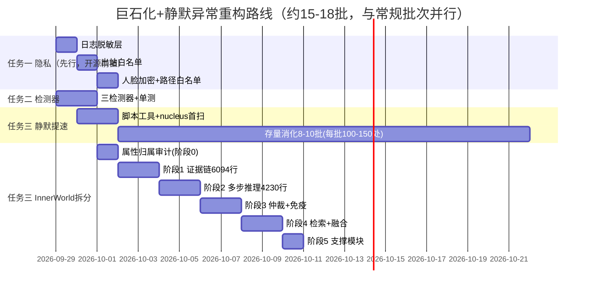

# 曈曈PulseNet 第三方后续深度分析报告（三方向）

**执行方**：第三方独立分析（TRAE）｜**日期**：2026-09-26｜**基线**：`fda267d`（第129批）
**依据**：[第三方后续深度分析任务书_20260926.md](第三方后续深度分析任务书_20260926.md)
**约束**：全程只读；所有方案贴合现有架构（器官化+脉冲总线+self_inspector检测器注册模式）；只输出方案不改代码。

**方案落点实测依据**（已核实）：
- [logger.py](../nucleus/logger.py)：标准 logging 双通道（console:539 / SafeRotatingFileHandler:561），PulseFormatter:105，LogAggregationFilter:44——脱敏层有唯一干净插入点
- [self_inspector.py](../nucleus/self_inspector.py)：检测器签名 `_check_xxx(body, file_path, organ, method, start_line, issues)` + `GLOBAL_DETECTORS` 全库级注册表（:2687）+ AST缓存 + `skip_detectors` 耗时下推（:2702，全量扫描约9分钟的教训已内建）；**已有** method_length:3232 / print_debug:2535 / silent_exception:3194 / bare_except:3267 检测器
- [PulseInnerWorld.py](../organs/brain/PulseInnerWorld.py)：23251行/367方法/**21个SECTION分区**（第30批已做过一次"提取推理检测器"的先例）——天然拆分缝已存在
- [PulseLiver.py](../organs/body/PulseLiver.py#L9)：两级压缩（`_compress_l1_to_l2`/`_fuse_l2_to_l3`）+ 独立冷却计时器(:92) + 质量门控 `_assess_node_quality` + L2→L3构图（圈复杂度133）
- 人脸册：[PulseVisualCortex.py:89-91](../organs/senses/PulseVisualCortex.py#L89) `data/identity/face_roster.json` 明文JSON，`safe_read_json/safe_write_json` 读写，env `TONGTONG_FACE_ROSTER` 可重定向(:970)
- 出站点：[RssCollector.py:50-54](../nucleus/knowledge/RssCollector.py#L50)、[WikiQuerier.py:121](../nucleus/knowledge/WikiQuerier.py#L121)；RSS源5个硬编码于 [config.py:143-149](../config.py#L143)，百科 url_template:171
- 静默except分布（严格口径386处/184文件）：PulseNodePool 21、health_ui 12、PatchManager 8、ReasoningWorkerPool 8、fast_ops 7

---

# 任务一：开源前隐私合规整改清单（P0）

## 1.1 日志脱敏层

**落点决策：handler级 Filter（中间件），不做调用点改造。**
理由：调用点改造需触碰 1000+ 处 print/上万个 logger 调用点（不现实且必有遗漏）；logging 的 Filter 在 record 进入 handler 前统一改写 record.msg，一处生效全库覆盖，且 console/file 双通道可分别配置（console 脱敏、file 按开关）。

**必须脱敏的字段与正则**（新建 `nucleus/logging/sanitizer.py`）：

```python
# nucleus/logging/sanitizer.py —— 方案骨架（约120行）
import re

_PATTERNS = [
    # 1. API Key（OpenAI/Ark/DashScope 全系 sk- 前缀及通用 key=value 形态）
    (re.compile(r"\bsk-[A-Za-z0-9_\-]{16,}\b"), "<REDACTED_KEY>"),
    (re.compile(r"(?i)\b(api[_-]?key|token|secret|authorization)\s*[=:]\s*\S+"), r"\1=<REDACTED>"),
    (re.compile(r"\bBearer\s+[A-Za-z0-9._\-]{16,}"), "Bearer <REDACTED>"),
    # 2. 手机号（1开头11位，避免误伤时间戳：前后非数字）
    (re.compile(r"(?<!\d)1[3-9]\d{9}(?!\d)"), "<REDACTED_PHONE>"),
    # 3. 邮箱
    (re.compile(r"\b[\w.+-]+@[\w-]+\.[\w.]+\b"), "<REDACTED_EMAIL>"),
    # 4. 身份证（15/18位）
    (re.compile(r"(?<!\d)\d{15}(?!\d)|(?<!\d)\d{17}[\dXx](?!\d)"), "<REDACTED_ID>"),
    # 5. 人脸册路径（含身份含义的路径指纹）
    (re.compile(r"[A-Za-z]:\\[^\s]*face_roster\.json"), "<REDACTED_FACE_PATH>"),
    (re.compile(r"[A-Za-z]:\\[^\s]*identity\\"), "<REDACTED_ID_PATH>"),
]

def sanitize(text: str) -> str:
    for pat, repl in _PATTERNS:
        text = pat.sub(repl, text)
    return text

class SanitizingFilter(logging.Filter):
    """★方案：Filter内改写record，对调用方零侵入"""
    def __init__(self, enabled: bool = True):
        super().__init__()
        self.enabled = enabled
    def filter(self, record: logging.LogRecord) -> bool:
        if self.enabled:
            try:
                record.msg = sanitize(str(record.msg))
                if record.args:
                    record.args = tuple(
                        sanitize(str(a)) if isinstance(a, str) else a for a in record.args)
            except Exception:
                pass  # 脱敏自身失败不得阻断日志
        return True
```

**接线**（[logger.py:539-570](../nucleus/logger.py#L539) 两处 addHandler 前各加一行）：

```python
# config.py 新增：
ENABLE_LOG_SANITIZER = True       # 主开关（默认开）
LOG_SANITIZER_DEBUG_MODE = False  # 白名单DEBUG：True时console不脱敏仅file脱敏
# logger.py setup 处：
from nucleus.logging.sanitizer import SanitizingFilter
file_handler.addFilter(SanitizingFilter(enabled=True))              # 文件日志永远脱敏
console_handler.addFilter(SanitizingFilter(enabled=not LOG_SANITIZER_DEBUG_MODE))
```

**对话内容怎么办（实事求是的设计取舍）**：对话整段脱敏=日志失去诊断价值，**不做全量打码**。方案：脱敏层只处理结构化个人敏感信息（上表5类），对话原文保留语义；补充一条 `REDACT_USER_UTTERANCE=False` 开关，开源模板/演示模式下用户可自行开启把用户侧发言替换为 `<USER>`。这兼顾"开源合规底线"与"自认知功能所需的对话可读性"。

**脱敏后怎么调试**：`LOG_SANITIZER_DEBUG_MODE=True` 时 console 通道免脱敏、文件通道仍脱敏——开发者在屏幕上看全量、落盘的是安全版；另提供 `python -c "from nucleus.logging.sanitizer import sanitize; print(sanitize(open('logs/pulse.log',encoding='utf-8',errors='ignore').read()[-5000:]))"` 式自检命令验证命中。

**工作量**：sanitizer.py 约120行 + logger.py 接线6行 + config 3行 + 测试1个（含正则用例表约15条）≈ **200行/1批**。

## 1.2 人脸生物特征加密方案

**方案对比与推荐（分两步走）**：

| 方案 | 依赖 | 强度 | 工作量 | 结论 |
|------|------|------|--------|------|
| A. XOR+机器码混淆 | 零依赖 | 低（防误接触，不防有心人） | ~80行 | **MVP采纳**（开源前） |
| B. cryptography.Fernet | +cryptography库 | 标准 | ~60行+依赖管理 | 开源正式版推荐 |
| C. Windows DPAPI | 平台绑定 | 标准 | 中 | 排除（破坏跨平台） |

**MVP代码方案**（改造点集中在 [PulseVisualCortex.py](../organs/senses/PulseVisualCortex.py) 的 `_face_roster_path`/读(:161,1029)/写(:988,1033) 三处，共约80行）：

```python
# 新增 nucleus/security/face_codec.py
import base64, getpass, hashlib, json, os

def _machine_key() -> bytes:
    """机器码混淆：MAC+用户名派生密钥（MVP级，防'拷走即得'）"""
    mac = uuid.getnode().to_bytes(6, "big")
    seed = f"{mac.hex()}|{os.getlogin()}|tongtong-face-v1"
    return hashlib.sha256(seed.encode()).digest()

def encode_roster(data: dict) -> str:
    raw = json.dumps(data, ensure_ascii=False).encode("utf-8")
    key = _machine_key()
    xored = bytes(b ^ key[i % len(key)] for i, b in enumerate(raw))
    return "TT-FACE-V1:" + base64.b64encode(xored).decode()

def decode_roster(text: str) -> dict:
    if not text.startswith("TT-FACE-V1:"):
        return text if isinstance(text, dict) else {}   # 兼容旧明文册（首读后即转加密）
    xored = base64.b64decode(text[len("TT-FACE-V1:"):])
    key = _machine_key()
    raw = bytes(b ^ key[i % len(key)] for i, b in enumerate(xored))
    return json.loads(raw.decode("utf-8"))
```

写入点把 `safe_write_json(path, data)` 换成 `safe_write_text(path, encode_roster(data))`，读取点对称。**兼容策略**：读到旧明文格式时照常加载并在下次写时自动转加密（灰度迁移，无需一次性迁移脚本）。

**env 重定向白名单（要加）**：[PulseVisualCortex.py:970](../organs/senses/PulseVisualCortex.py#L970) 现在任意路径可重定向。改为：仅当解析后的路径位于 `data/` 目录内才生效，否则回退默认路径并打 WARN（防补丁/脚本把人脸册引到任意位置）：

```python
def _face_roster_path(self) -> str:
    _p = os.environ.get("TONGTONG_FACE_ROSTER", self._FACE_ROSTER_PATH)
    _data_root = os.path.realpath(os.path.join(_PROJECT_ROOT, "data"))
    if not os.path.realpath(_p).startswith(_data_root):
        self._log(LogLevel.WARNING, f"[R5] TONGTONG_FACE_ROSTER 越界({ _p })，回退默认册路径")
        return self._FACE_ROSTER_PATH
    return _p
```

**访问控制**：单机场景跨平台 ACL 复杂度高、收益低，**不做文件ACL**；以"落盘加密+路径白名单+脱敏层隐藏路径"三层替代（等B方案Fernet落地后强度再升一级）。

**工作量**：face_codec.py 80行 + PulseVisualCortex 4处改造 + 测试1个 ≈ **150行/0.5批**。

## 1.3 出站请求白名单

**新建统一守卫 `nucleus/security/outbound_guard.py`**（约90行），三个出站点全部接入：

```python
# nucleus/security/outbound_guard.py
import ipaddress, socket
from urllib.parse import urlparse

ALLOWED_SCHEMES = {"http", "https"}
# config 可覆盖：OUTBOUND_HOST_WHITELIST = ["www.solidot.org", "www.infoq.cn",
#   "feed.cnblogs.com", "www.ruanyifeng.com", "sspai.com", "baike.baidu.com"]
_DEFAULT_HOSTS = {...上面六个...}

def _is_private_host(host: str) -> bool:
    try:
        infos = socket.getaddrinfo(host, None)
        for inf in infos:
            ip = ipaddress.ip_address(inf[4][0])
            if (ip.is_private or ip.is_loopback or ip.is_link_local
                    or ip.is_reserved or ip.is_multicast):
                return True
    except socket.gaierror:
        return True          # 解析失败=拒绝（fail-closed）
    return False

def validate_outbound(url: str) -> tuple[bool, str]:
    try:
        u = urlparse(url)
    except Exception:
        return False, "parse_error"
    if u.scheme not in ALLOWED_SCHEMES:
        return False, f"scheme_denied:{u.scheme}"
    host = (u.hostname or "").lower()
    if host not in _current_whitelist():          # config热加载读取
        return False, f"host_not_whitelisted:{host}"
    if _is_private_host(host):                    # SSRF核心：DNS解析后再验IP
        return False, "private_ip_denied"
    return True, "ok"
```

**三个改造点**（各2行）：

```python
# RssCollector.py:50 _default_fetch 开头；WikiQuerier.py:121 urlopen 前；
# （以及 visual_engines/pdf_engine.py 若存在远程取图路径——同款守卫）
from nucleus.security.outbound_guard import validate_outbound
_ok, _why = validate_outbound(url)
if not _ok:
    raise ValueError(f"[OutboundGuard] 拒绝出站请求: {_why} url={url[:120]}")
```

**设计要点（实事求是的三条）**：
1. **fail-closed + 白名单默认值**：默认白名单=当前 config.py:143-149 五个RSS源+baike.baidu.com，行为零变化；新源需显式加白，这正是意图（防补丁篡改config注入新源）。
2. **必须做 DNS 解析级校验**（`getaddrinfo` 后验IP），只查 hostname 字符串挡不住 `http://内网域名/` 与 DNS rebinding 的初级形态。
3. **私有IP段覆盖**：127/8、10/8、172.16/12、192.168/16、169.254/16、::1、fc00::/7、fe80::/10（ipaddress 库的 is_private/is_loopback/is_link_local 已全含）。

**工作量**：guard 90行 + 3处接线 + config 白名单项 + 测试（scheme拒绝/私网拒绝/白名单放行/DNS失败拒绝 4用例）≈ **180行/0.5批**。

## 1.4 优先级、工作量与开源MVP

| 优先级 | 项 | 代码量 | 批次 | 理由 |
|--------|-----|--------|------|------|
| P1 | 日志脱敏层 | ~200行 | 1批 | **泄露面最大**（logs/是运行必产物），且对话/对话元数据持续累积 |
| P2 | 出站白名单 | ~180行 | 0.5批 | 唯一"可被外部利用"的注入面（补丁→config→外联） |
| P3 | 人脸册加密+路径白名单 | ~150行 | 0.5批 | 单机场景实际风险最低，但属"生物特征"合规敏感项 |
| — | 脱敏自检工具+文档 | ~60行 | 并入P1 | 开源README需声明"日志默认脱敏" |

**开源前最小集合（MVP）= P1+P2+P3 全部**：合计约 **590行 / 2批**。理由：三项各自独立、都小、都有测试，没有"再等等"的理由；其中 P1/P2 若赶时间可先于 P3 发布（人脸功能默认关闭摄像头场景下暴露有限），但**P1 是绝对底线**。

---

# 任务二：self_inspector 补充检测器设计（P1）

## 2.0 接入模式总述

现有两类检测器：方法级 `_check_xxx`（23个）与全库级 `GLOBAL_DETECTORS`（3个）。三个新检测器分属三种新形态——**运行时指标型（L3倒挂）**、**文件度量型（巨石化）**、**趋势对比型（静默增长率）**，均无需新增扫描框架：

```python
# self_inspector.py 内新增（与 GLOBAL_DETECTORS 并列）：
RUNTIME_DETECTORS = {"l3_inversion": "_detect_l3_inversion"}      # 读runtime_state，<1ms
FILE_METRIC_DETECTORS = {"god_file": "_detect_god_file"}          # 复用AST缓存，增量~0
TREND_DETECTORS = {"silent_growth": "_detect_silent_growth"}      # 复用silent_exception结果计数
```

## 2.1 L3倒挂检测器（运行时指标型）

```python
def _detect_l3_inversion(self, issues: list) -> None:
    """★运行时检测器：知识金字塔倒挂。数据源 runtime_state.json（肝脏已落盘），
    不做AST扫描，周期由调用方（每N个tick一次）控制，成本<1ms。"""
    import json, os
    _p = os.path.join(_PROJECT_ROOT, "data", "runtime_state.json")
    try:
        _ke = json.load(open(_p, encoding="utf-8")).get("evolution", {}).get("knowledge_evolution", {})
    except Exception:
        return
    _l1, _l3 = _ke.get("l1_count", 0), _ke.get("l3_pure", 0)
    if _l1 < 50:            # 重启初期L1重建中，避免误报（09-26实测重启后L1=492）
        return
    _ratio = _l3 / max(_l1, 1)
    _level = "high" if _ratio > 8.0 else ("medium" if _ratio > 6.0 else None)
    if _level:
        issues.append({
            "file": "runtime", "organ": "PulseLiver", "method": "_fuse_l2_to_l3",
            "line": 0, "type": "knowledge_pyramid_inversion",
            "severity": _level,
            "description": f"L3/L1={_ratio:.1f}:1 (L3={_l3}, L1={_l1})，"
                           f"超过告警阈值{'8' if _level=='high' else '6'}:1（宪法意图：L3应稀少）",
            "suggestion": "①触发肝脏 _check_and_optimize 立即执行一轮 L2→L3 融合；"
                          "②核查 _fuse_l2_to_l3 冷却间隔(_last_fuse_time)与构图门槛；"
                          "③必要时调低 _assess_node_quality 对 L2 摘要的准入分"})
```

**阈值依据**：实测当前 L3/L1 = 3473/492 ≈ **7.1:1**（重启后口径）与 3236/2754 ≈ 1.2:1（09-14满载口径）差异巨大——故阈值不能拍死：**告警基线=滚动7天自身均值的1.5倍**（自适应）+ 绝对上限 8:1（兜底），两条件取或，避免重启初期/满载两态间的误报。

**检测周期**：随 self_inspector 常规轮询（与现有周期一致），但**每24h最多记一条**（防日志风暴，复用 LogAggregationFilter 思路）。

**告警动作**：写 issue（high级，进自主进化链路的 high/medium 消费通道）+ 发 `KnowledgeEvent` 脉冲让肝脏收到"立即融合"请求（**不直接调用**，保持器官间只走脉冲的纪律）。

**肝脏吞吐不足根因分析（实测）**：
1. **双冷却节奏**：`_last_fuse_time` 独立冷却(:92)，L2→L3 融合频率受冷却限制——每冷却周期只消化一批；
2. **构图成本高**：`_build_knowledge_association_graph`（圈复杂度133，全库Top12）每次融合全量构图，L2=8178 时单次构图代价随规模上涨——**吞吐随库存增长而下降**，这正是 L3 只出不进的动力学；
3. **质量门控单点**：`_assess_node_quality` 拒绝即丢弃本轮，无重试排队。
**建议**（供后续批次，本次只记录不改）：构图改增量（只算新增节点的关联边）；被拒节点进 `retry_queue` 而非直接丢弃；融合节拍与队列水位联动（L2>8000 时冷却减半）。

## 2.2 巨石化检测器（文件度量型）

```python
def _detect_god_file(self, organ_data: dict, issues: list) -> None:
    """★复用_scan_all_organs()的AST缓存，每文件多算一次行数+每方法分支数，
    增量成本≈0（分支计数在解析缓存上做）。"""
    _THRESH = {"file_lines_warn": 3000, "file_lines_high": 5000,
               "method_branches_warn": 80, "method_branches_high": 120,
               "method_count_warn": 120}
    for _file, _data in organ_data.items():
        _lines = _data.get("total_lines", 0)
        if _lines >= _THRESH["file_lines_high"]:
            issues.append({...  "type": "god_file", "severity": "high",
                "description": f"{_file} 达 {_lines} 行（阈值5000）",
                "suggestion": "按SECTION分区启动mixin拆分（见后续深度分析报告任务三）"})
        for _m in _data.get("methods", []):
            _b = _count_branches(_m)     # ast.walk计数 if/for/while/except/BoolOp
            if _b >= _THRESH["method_branches_high"]:
                issues.append({... "type": "god_method", "severity": "high",
                    "description": f"{_file}:{_m.lineno} {_m.name} 分支数={_b}（阈值120）"})
```

**阈值设定依据（用实测数据反推，避免拍脑袋）**：行数 warn=3000 / high=5000（当前Top10全部命中→初始即产出Top10问题清单）；分支 warn=80 / high=120（当前max=285，Top6全部>160→首扫即暴露全部热点）。**重点监控Top10**（第一轮报告§2.3表）：PulseInnerWorld 23249 / SafeEvolutionExecutor 5878 / PulseSubconscious 4759 / self_inspector 4260 / PulseCodeLearner 4138 / PulseLiver 3725 / PatchManager 3791 / PulseCortex 3568 / PulseController 3529 / PulseNodePool 3441。

**周期**：每次全库扫描附带（有 skip_detectors 下推机制兜底，自主进化链路只消费 high/medium，低值告警不会拖慢主链）。

## 2.3 静默异常增长率检测器（趋势对比型）

```python
def _detect_silent_growth(self, issues: list) -> None:
    """★不重复扫描：复用本轮 _check_silent_exception 的命中计数，与基线文件对比。"""
    _baseline_p = os.path.join(_PROJECT_ROOT, "data", "self_inspector", "silent_baseline.json")
    _cur = {"total": <本轮命中数>, "ts": time.time()}
    _old = json.load(open(_baseline_p)) if os.path.exists(_baseline_p) else None
    if _old:
        _delta = _cur["total"] - _old["total"]
        if _delta > 0:
            issues.append({... "type": "silent_exception_growth", "severity": "high",
                "description": f"静默异常 {old}->{cur}（+{_delta}），pre-commit hook 之外出现新增",
                "suggestion": "定位新增文件并纳入下一批清偿；检查hook是否被--no-verify绕过"})
        elif _delta > -20 and (cur_ts - old_ts) > 7*86400:
            issues.append({... "type": "silent_digestion_slow", "severity": "medium",
                "description": f"静默清偿速率不足：7天仅消化{abs(_delta)}处（存量{cur}，速率目标≥20/周）",
                "suggestion": "提升脚本化改造占比（见后续深度分析报告任务三3.2）"})
    json.dump(_cur, open(_baseline_p, "w"))
```

**指标与周期**：每次全库扫描对比一次（写入基线文件 data/self_inspector/silent_baseline.json）；两条规则——**新增>0即high**（hook之外的新增意味着流程被绕过）＋**7天消化<20处即medium**（按任务三3.2提速后目标≥100/周，阈值应随路线图上调）。

## 2.4 接入方案与性能影响

| 检测器 | 形态 | 性能成本 | 开关（config新增） |
|--------|------|---------|-------------------|
| l3_inversion | RUNTIME | <1ms（读一个json） | `ENABLE_INSPECTOR_L3_INVERSION = True` |
| god_file | FILE_METRIC | ≈0（复用AST缓存与既有方法遍历） | `ENABLE_INSPECTOR_GOD_FILE = True` |
| silent_growth | TREND | ≈0（复用本轮计数） | `ENABLE_INSPECTOR_SILENT_TREND = True` |

- 三者默认开启但**均有config开关**，与项目"预埋设计原则"（ENABLE_开关143个的既有惯例）一致；
- 均不进 `skip_detectors` 高耗时黑名单（dead_code 9分钟的教训：新增检测器必须保证被跳过时零残留状态）；
- 问题类型登记进 `:294` 的问题说明字典，保证"每条发现必须说明什么输入/时序下会导致什么后果"的既有规范；
- **回归验证**：m95门禁模式——新增单测用伪造 organ_data/runtime_state 断言三类检测器输出（预计3个测试文件约30用例）。

---

# 任务三：巨石化+静默异常重构方案（P2）

## 3.1 PulseInnerWorld 拆分方案

**拆分原则（按实测结构定）**：**沿21个SECTION天然缝拆，采用 Mixin 继承而非服务对象**。理由：①367个方法大量共享 `self._xxx` 状态，服务对象方案需先做状态归属审计+改写全部访问路径（风险大）；②第30批"从_on_inference_request提取推理检测器"已是 Mixin 式先例，项目有成功经验；③Mixin不改变 `PulseInnerWorld` 的导出路径与 organ_loader 加载方式（[organ_loader.py](../nucleus/organ_loader.py) 零改动）。

**阶段0（前置，必须先做）：属性归属审计脚本**
写一次性 stdin 脚本（不落盘进框架）：AST 扫描 367 个方法，输出 `属性 → 读写分区` 矩阵。**跨≥3个分区写入的属性**（预期是 `self._nodes`、缓存类、统计计数器）列为"共享状态"，留在主类；其余随分区走。这一步把拆分风险从"感觉"变成"清单"。

**分五阶段（按"最独立、最边缘"→"最核心"排序，每阶段一个文件）**：

| 阶段 | 拆出内容 | 行段 | 预估行数 | Mixin文件 | 风险 |
|------|---------|------|---------|-----------|------|
| 1 | 可验证推理证据链 | 9986-16080 | ~6094 | `innerworld/evidence_chain.py` | 低（最独立） |
| 2 | 真多步推理 | 18583-22813 | ~4230 | `innerworld/multi_step.py` | 低 |
| 3 | 矛盾仲裁+知识免疫系统 | 3540-5769 + 16080-16095 | ~2250 | `innerworld/arbitration.py` | 中（仲裁预埋段与证据链有调用） |
| 4 | 知识检索+本地多节点融合 | 7610-9986 | ~2376 | `innerworld/knowledge.py` | 中（`_knowledge_retrieve` 165分支、被多处调用） |
| 5 | QICA执行器+推理缓存+共振+统计 | 5769-7610 + 22813-23251 | ~1800 | `innerworld/support.py` | 低 |
| 残留 | 主类：脉冲入口+事件处理+推理路由+框架注入 | 1-3540 + 预留 | ~6000 | PulseInnerWorld.py 本体 | — |

**`_on_inference_request`（285分支）专项**：不按任务书字面的"3个子模块"硬拆，按实测结构拆为**沿既有缝的四级流水**（第30批已提取"推理检测器"段2018-2384，证明此路可通）：
1. **路由层**（保留主类）：意图分类→选路径，目标分支数<60；
2. **检索供给**（阶段4的 knowledge.py 提供）：`_knowledge_retrieve`+`_route_to_deriver` 输入准备；
3. **推理执行**（阶段2的 multi_step.py / 阶段1的 evidence_chain.py 提供）；
4. **表达生成**（阶段5 support.py 的缓存+格式化）。
主方法瘦身为"编排器"，只做调用与结果合并——**拆的是被调用方，不是调用方**，这是285分支函数唯一低风险的下刀方式。

**不能动的地方（风险红线）**：
- 器官注册与脉冲订阅顺序（构造期行为， organ_loader 依赖初始化时序）；
- 所有 `from organs.brain.PulseInnerWorld import PulseInnerWorld` 的外部导入路径（grep 确认后列入冻结清单）；
- P3-1 公开访问器分区（16095-18583，它就是为"消除跨模块私有穿透"而设的公共契约）；
- `_on_inference_request` 的对外签名与返回结构（推理链路契约）。

**每阶段回归验证（四道闸，全部复用现有门禁）**：
1. `python -m pytest tests` 全量 4214 例；
2. m95式批次门禁单测 + ruff F=0 + py_compile；
3. **接口签名冻结校验**：stdin 脚本对比拆分前后 `PulseInnerWorld` 公开方法签名集合（新增允许、删除/改签名即失败）；
4. 运行时冒烟：重启框架观察 pulse_errors=0、self_inspector 无新增 high 问题、runtime_state 器官 65/65 running。

**每阶段工作量**：阶段0=0.5批；阶段1-5各≈1.5批（搬移+测试+门禁）；**合计≈8批**。

## 3.2 静默异常提速方案

**现状**：1416处（门禁口径）/386处（严格 pass 口径），每批~30处人工改。

**模式分类（决定自动化比例）**：
- **模式A（可脚本预改，预估占~70%）**：`except ...: pass` 且上下文是"探测/兜底/可忽略"——机械替换为 `silent_exc(e, where="文件:函数")`（[nucleus/_silent_except.py](../nucleus/_silent_except.py) 基建现成，第78批已建，带灰度开关 `enable_silent_except_logging`）；
- **模式B（半自动，~20%）**：`except: <无日志continue/return>`——脚本替换模板+人工补 where 语义；
- **模式C（纯人工，~10%）**：pass 本身是错误处理缺失（如 PatchManager 类核心路径）——人工判断补日志/重抛。

**批量改造脚本设计（一次性工具，放 tools/，不进框架）**：

```python
# tools/batch_fix_silent_except.py —— 方案骨架
# 输入：目标文件清单（优先级排序）；动作：AST定位 except-pass → 替换为 silent_exc 调用
# 产出：逐文件 unified diff 到 tmp/silent_fix_diff/，【不直接写回】
# 人审：抽查20% diff + 全量跑门禁 → 通过后 git apply
```

**优先级排序**（按"故障排查价值×调用频度"）：
1. nucleus/reasoning/（PatchManager 8 + ReasoningWorkerPool 8 + SafeEvolutionExecutor 裸except 7）——进化主链路，静默=进化失明；
2. nucleus/mnemosyne/PulseNodePool.py（21处，全库最高）——记忆层；
3. nucleus/fast_ops.py、self_inspector.py、logger 自身——基建层；
4. organs/（先 body/brain 主器官）；
5. functions/、tools/（边缘最后）。

**预期提速（实事求是）**：脚本预改+人审模式每批可处理 **100-150处**（脚本生成diff分钟级，人工成本集中在20%抽查与模式C），是现状的3-5倍；**1416存量 ≈ 8-10批清完**（vs 现在需要40+批）。增速端已被 pre-commit hook（第126批）封死，存量消化完成后 CI"新增=0"门禁自动变成"总量=0"门禁。

**风险与回滚**：silent_exc 只加 DEBUG 日志不改控制流（零行为变化，hook 与 CI 双保险）；每批改造独立提交，异常时可单批 revert；灰度开关 `enable_silent_except_logging` 可全局关闭新日志。

## 3.3 重构路线图



**先后顺序的依据**：①隐私三件套最先（开源阻塞项，且改动小与重构零冲突）；②检测器第二批上（上线后 InnerWorld 拆分每阶段的" god_file 下降"有客观度量，形成反馈闭环）；③静默提速与拆分**并行**（两者触碰文件集几乎不相交：静默主战场在 nucleus/，拆分主战场在 organs/brain/）；④InnerWorld 按"先边缘后核心"五阶段，每阶段独立可回滚。

**里程碑**：
- **M1**（+3批）：隐私MVP完成，可安全开源；检测器上线，god_file/silent趋势进周报；
- **M2**（+8批）：静默存量<400；InnerWorld <17000行（阶段1-2完成）；
- **M3**（+15-18批）：静默≈0，hook门禁升级为"总量=0"；InnerWorld <6500行（主类），`_on_inference_request` 分支数<60，L3/L1回落至告警线内。

**总工期**：约 **15-18批**（含验证批次余量）；其中纯重构占约13批，其余为工具/测试/审计。

---

## 附：本次分析的方法声明

- 全部现状数据为 2026-09-26 只读实测（文件行数/检测器清单/SECTION分段/配置项均逐一核实），方案中的"预估"（自动化比例70%、提速3-5倍、批次工期）为基于实测分布的工程估算，属推测判断，需在阶段0/首批试点后校准；
- 所有代码骨架为方案示意（未落盘、未执行），采纳时需按项目 CODE_STYLE.md 补头部规范与 ruff 全过；
- 与第一轮报告的衔接：本报告三项分别对应第一轮 Top20 建议的 #1/#2/#3（隐私三件套）、#15（L3检测器）、#6/#7/#12（拆分/静默提速/print），优先级保持一致。
