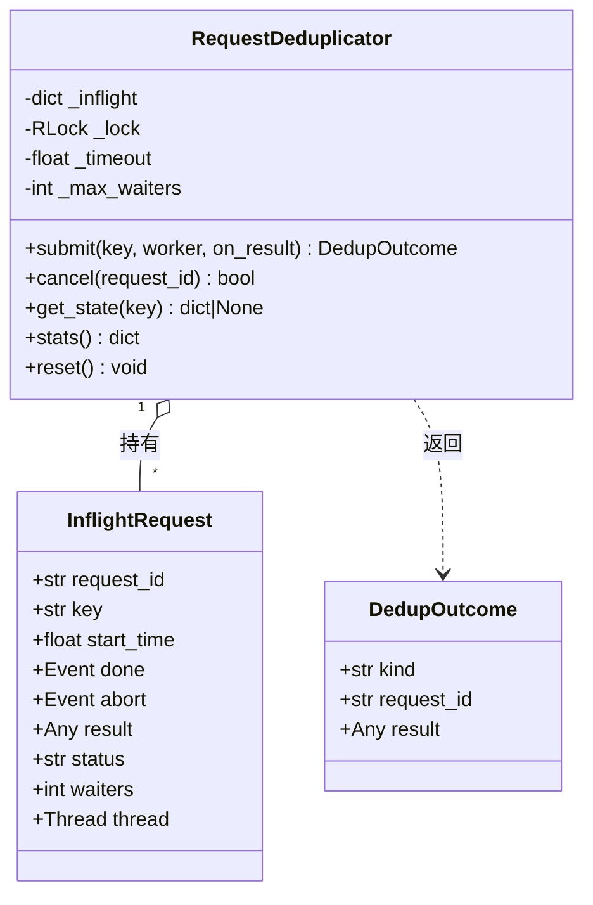
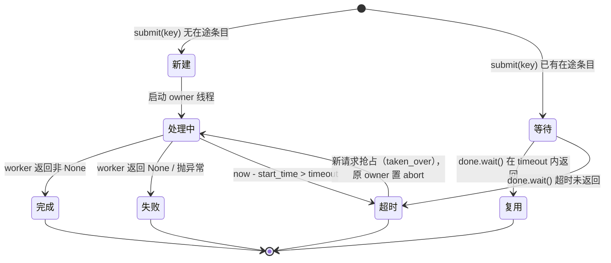

# RequestDeduplicator 设计文档 v1.0

**任务来源**：主线第25批 T4（P2-161）
**日期**：2026-09-11
**作者**：路灯
**状态**：📋 设计待审（经星轨审核通过后于第26批实施）
**关联**：P2-160（重复调用根因）、`organs/body/PulseLung.py`、`organs/brain/PulseCortex.py`

---

## 实施状态（★第26批补充）

**本设计文档 v1.0 已于主线第26批（2026-09-11）实施落地**，实施时**按第26批任务书的接口要求做了调整**：

| 项 | 设计文档 v1.0 | 第26批实施版（以任务书为准） |
|---|---|---|
| 文件位置 | nucleus/concurrency/RequestDeduplicator.py | **nucleus/field/RequestDeduplicator.py** |
| 主入口 | submit(key, worker, on_result) -> DedupOutcome | **try_claim(request_id) -> claimed / waiting / duplicate** |
| 完成 | submit 内部自动完成 | **complete(request_id, result)** |
| 取结果 | DedupOutcome.result | **get_result(request_id)** |
| 取消 | cancel(request_id) | cancel(request_id)（一致） |
| 超时参数 | timeout=30.0 | timeout=30（一致） |
| 等待上限 | max_waiters=8 | max_wait=10 |

**语义保持一致**：「等待复用 / 超时接管 / 已完成直接复用」三态语义未变。
`submit` 的四种返回（owner_done / reused / taken_over / rejected）分别对应
实施版的 claimed / duplicate / claimed(接管) / waiting。

**★实施中新增的关键修正（设计文档未覆盖）**
第25批的止血方案（3 秒时间窗「命中即跳过」）位于 `_on_select_model` **更靠前**的位置，
会抢在去重器之前拦截 → 去重器形同虚设（D1/D2 缺陷依旧）。
实施时改为：**去重器开启（`ENABLE_REQUEST_DEDUP=True`）时跳过止血**，
去重器关闭（默认 False）时止血行为完全不变（零回归）。

**灰度**：`ENABLE_REQUEST_DEDUP` 默认 **False**；可用环境变量 `PULSE_REQUEST_DEDUP=1` 开启。
**测试**：`tests/test_request_dedup_m26.py`（18 例）。
**接入**：`PulseLung._on_select_model` 对话路径（后台学习/主动交互不参与）。

---

## 一、问题定义

### 1.1 现状（第25批实测）

用户在 3 秒内对同一问题触发两次请求时，当前只有**时间窗去重**（`PulseLung._is_duplicate_request`，窗口 3s，`PulseLung.py:136-147`）：命中即**直接跳过**并返回空答案。

### 1.2 该方案的三个缺陷

| 编号 | 缺陷 | 后果 |
|---|---|---|
| D1 | 第二个请求被**无条件丢弃** | 若第一个请求实际未产生有效回复（渠道全失败），用户永远等不到答案 |
| D2 | 第一个请求**卡住（渠道超时 30s）**时，第二个也被跳过 | 用户以为系统无响应；且第一个最终失败后没有任何补位 |
| D3 | 去重判据只有「prompt 文本哈希」 | 不同用户/不同会话的相同文本被互相误伤 |

### 1.3 目标（用户提出的优雅方案）

1. 第一个请求**处理中** → 第二个请求**等待**并**复用**第一个的结果；
2. 第一个请求**超时未完成** → 第二个请求**终止**第一个并**重新处理**；
3. 第一个请求**已完成** → 第二个请求**直接复用**结果。

---

## 二、类设计

### 2.1 类图



### 2.2 方法签名

```python
class RequestDeduplicator:
    def __init__(self,
                 timeout: float = 30.0,        # 单请求超时（秒），config 可配
                 max_waiters: int = 8,        # 同一 key 最多等待者
                 join_poll: float = 0.05) -> None: ...

    def submit(self, key: str, worker: Callable[[Event], Any],
               on_result: Callable[[DedupOutcome], None] | None = None
               ) -> DedupOutcome:
        """提交一次请求。自动判定 新建 / 等待复用 / 超时抢占。

        返回值 kind ∈ {"owner_done", "reused", "taken_over", "rejected"}
        - owner_done : 本调用是首个请求且已完成，result 为返回值
        - reused     : 已有在途同 key 请求，等待后复用其结果
        - taken_over : 原请求超时，本调用终止它并成为新 owner
        - rejected   : 等待者超限或 key 非法
        """

    def cancel(self, request_id: str) -> bool:
        """请求取消：置 abort 事件，worker 应尽快返回；owner 线程回收后清理条目。"""

    def get_state(self, key: str) -> dict | None:
        """查询某 key 的在途状态（诊断/监控用）。"""

    def stats(self) -> dict:
        """累计统计：submitted / reused / taken_over / timed_out / cancelled。"""

    def reset(self) -> None:
        """清空全部在途条目（测试/关停用）。"""


class DedupOutcome(NamedTuple):
    kind: str
    request_id: str
    result: Any = None
```

### 2.3 worker 契约

```python
def worker(abort: threading.Event) -> Any:
    """执行真实工作（如调用大模型）。

    必须在耗时循环中检查 `abort.is_set()`；一旦置位应尽快 return None，
    以便 owner 线程让位（taken_over 路径）。
    """
```

---

## 三、状态机



**关键判定表**

| 条件 | 进入状态 | 结果 |
|---|---|---|
| key 无条目 | 新建 | 成为 owner，异步执行 worker |
| key 有条目且未超时 | 等待 | `done.wait(timeout)`；完成则复用结果 |
| key 有条目且已超时 | 抢占 | `cancel(旧 id)` → 旧 owner 置 abort；本调用成新 owner |
| 等待者数 > max_waiters | 拒绝 | `kind="rejected"`（防雪崩） |

---

## 四、与肺的集成方式

### 4.1 接入点

在 `PulseLung._on_select_model`（`organs/body/PulseLung.py:149`）**替换**现有时间窗去重：

```python
# 现状（第25批保留为兜底）
if prompt and _is_dialogue_req and self._is_duplicate_request(prompt):
    return {"status": "duplicate_skipped", "answer": ""}

# 目标（第26批，灰度 ENABLE_REQUEST_DEDUP）
_outcome = self._dedup().submit(
    key=f"{user_name}|{prompt_hash}",         # ★加入用户维度，修复缺陷 D3
    worker=lambda abort: self._generate_reply(prompt, abort=abort),
)
if _outcome.kind == "reused":
    return {"status": "dedup_reused", "answer": _outcome.result}
```

### 4.2 与「对话错位防护」的关系

`PulseCortex` 已有 `_dialog_queue` / `_dialog_guard`（第15批）负责**跨轮次**排序；RequestDeduplicator 负责**同一轮次内**的重复合并。二者**分层并存、互不替代**：

| 层 | 组件 | 职责 | 去重键 |
|---|---|---|---|
| 轮次间 | `PulseCortex._dialog_guard` | 新输入排队/抢占，防话题错位 | `correlation_id` |
| 轮次内 | `RequestDeduplicator` | 同请求合并、超时接管 | `user_name + prompt_hash` |

### 4.3 与第25批「发射幂等」的关系

第25批已落地 `PulseCortex._claim_select_model_emit`（**发射侧**幂等，cid+prompt 指纹），解决「同一轮被两次驱动至 SELECT_MODEL」。RequestDeduplicator 是**执行侧**去重，解决「两次请求只要一个结果」。两者叠加后：

```
同一轮被两次驱动  → 发射幂等拦截（第25批，已上线）
不同轮同内容并发  → RequestDeduplicator 合并复用（第26批）
```

### 4.4 关停与清理

- `RequestDeduplicator.shutdown()` 由 `PulseFramework.stop()` 调用：置全部 `abort`，`join(timeout=5)`；
- 条目在 owner 线程 `finally` 中删除，**不会泄漏**；
- 等待者不创建线程（复用 owner 的 `Event`），无线程爆炸风险。

---

## 五、线程安全设计

| 共享数据 | 保护方式 | 说明 |
|---|---|---|
| `_inflight`（dict） | `threading.RLock` | 读写均在同一把锁内；首次 `submit` 用 `setdefault` 语义原子建条目 |
| `InflightRequest.result/status` | `done` Event + 写后读（happens-before） | owner 先写 `result` 再 `done.set()` |
| `abort` 信号 | `threading.Event` | 抢占路径由新 owner 置位，旧 owner 在 worker 内轮询 |
| 等待者计数 | 同 `_inflight` 锁 | 超 `max_waiters` 直接 `rejected` |

**锁序**：只有一把锁（`_lock`），且**不在持锁期间调用 worker**（worker 在锁外执行）→ 无死锁风险。
**不使用 `Future.result()`**：`concurrent.futures` 的取消无法中断已在线程中运行的函数，故采用 `Event` + 协作式 abort（与项目 `subprocess.Popen` 无 `timeout` 形参的既有约束一致）。

---

## 六、测试用例设计（≥10 例）

| # | 用例 | 预期 |
|---|---|---|
| 1 | 单请求正常完成 | `kind="owner_done"`，result 正确 |
| 2 | 第二个请求在第一个**进行中**提交 | `kind="reused"`，结果与第一个**同一对象/等值**，worker 只执行 1 次 |
| 3 | 第一个请求**已完成**后提交 | `kind="reused"`（结果缓存窗口内） |
| 4 | 第一个请求**超时**后第二个提交 | `kind="taken_over"`；旧 request 的 `abort` 被置位 |
| 5 | 抢占后旧 owner 返回 | 旧结果**不覆盖**新 owner 的结果 |
| 6 | worker 抛异常 | 条目被清理，`done` 被置位，等待者不永久阻塞 |
| 7 | worker 返回 None（失败） | `kind` 视为失败；等待者可再次接管（可配 `retry_on_none`） |
| 8 | 等待者超过 `max_waiters` | 第 N+1 个 `kind="rejected"` |
| 9 | `cancel(request_id)` | 返回 True；owner 收到 `abort`；重复 cancel 返回 False |
| 10 | key 为不同用户 | 不合并（修复 D3） |
| 11 | 并发 50 线程同 key | worker 只执行 1 次，其余 49 个全部 `reused` |
| 12 | 并发 50 线程 50 个不同 key | worker 执行 50 次，无死锁、无计数泄漏 |
| 13 | `shutdown()` 期间有在途请求 | 全部在 5s 内退出，`_inflight` 清空 |
| 14 | 开关 `ENABLE_REQUEST_DEDUP=False` | `submit` 退化为直通执行（与改造前逐行为一致） |

---

## 七、配置项（第26批落地时加入 `config.py`）

```python
ENABLE_REQUEST_DEDUP = True          # 总开关；False 时完全退回时间窗去重
REQUEST_DEDUP_TIMEOUT_SEC = 30.0     # 单请求超时（对应 D2）
REQUEST_DEDUP_MAX_WAITERS = 8         # 同 key 最大等待者
REQUEST_DEDUP_REUSE_TTL_SEC = 5.0     # 结果复用窗口（对应 D1 的"已完成直接复用"）
REQUEST_DEDUP_KEY_INCLUDE_USER = True # key 含用户维度（对应 D3）
```

---

## 八、风险与权衡

| 风险 | 缓解 |
|---|---|
| 结果被多个请求共享 → 若结果含"按用户个性化"内容会串话 | key 默认含 `user_name`；`REQUEST_DEDUP_KEY_INCLUDE_USER=True` |
| 抢占频繁导致重复消耗 API 配额 | 抢占只在**超过 timeout** 时发生；且 owner 收到 abort 后立即停止后续轮询（`_call_via_channels` 已支持在循环中检查） |
| 与「对话错位防护」双重排队造成延迟叠加 | 两层键不同（cid vs prompt_hash），实际不会对同一请求同时触发；实施时需用 `get_dialog_guard_stats()` 观测验证 |
| 长任务被等待者拖住 | `max_waiters` + `timeout` 双限；`rejected` 直接返回"繁忙"提示（复用第24批进度提示通道） |

---

## 九、交付物与下一步

- **本批（第25批）**：本文档（设计）。
- **第26批（实施）**：
  1. 新增 `nucleus/concurrency/RequestDeduplicator.py`；
  2. `PulseLung._on_select_model` 接入（灰度 `ENABLE_REQUEST_DEDUP`）；
  3. 新增 `tests/test_request_dedup_m26.py`（≥14 例，覆盖 §六 全部用例）；
  4. 运行时验证：连续 5 次重复提问只产生 1 次大模型调用；超时场景下第二个请求能接管并给出答案。

**待星轨裁决**：
1. 超时阈值 30s 是否合适（当前与 `channel_timeout` 一致）；
2. `taken_over` 时是否要向用户追加"上一请求超时，正在重试"的可见提示；
3. 是否需要在 `RequestDeduplicator` 中直接内建渠道级重试（而非交给 `_call_via_channels`）。
