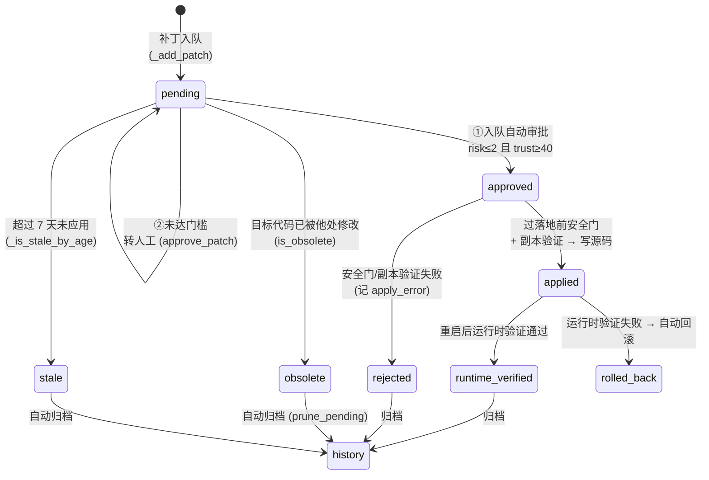

# 补丁自应用机制设计 v1.0

**文档编号**：设计文档 · 补丁自应用机制
**生成时间**：2026-09-14
**生成者**：路灯（主线第53批 T4）
**适用版本**：曈曈 PulseNet v10
**状态**：第53批 T1/T2 代码已落地；本文件描述**实施后**的真实机制（含行号取证）

---

## 一、设计目标与安全边界

补丁自应用要同时满足两个互斥目标：**自主迭代不能停**（问题要能被自动修掉）与
**危险改动不能自动落地**（代码修改权限不能被绕过）。本机制用「**分级门槛 + 多道安全门 +
全程留痕 + 失败即拒绝**」实现二者共存。

四条不可动摇的边界：

| 边界 | 实现 | 位置 |
|---|---|---|
| 总开关关闭则绝不自动改写源码 | `auto_apply_enabled` 检查在最前 | `SafeEvolutionExecutor.py:3734` |
| 两套信任分门槛必须同值 | 三处常量统一为 40 + 门控测试断言 | 见 §四 |
| 写盘失败绝不报成功 | `_save_json` 返回显式 bool + 调用方检查 | `PatchManager.py:_save_json / approve_*` |
| 核心文件禁止静默吞异常 | m7 门禁（7 个核心文件）| `tests/test_robustness_m7.py` |

---

## 二、状态流转



**状态语义**

| status | 含义 | 谁能设置 |
|---|---|---|
| `pending` | 入队，等待审批 | 所有生成源 |
| `approved` | 已批准，可被应用 | 入队自动审批 / `approve_patch` / `approve_all_patches` |
| `applied` | 已写入源码（带 `backup_path` 可回滚） | `apply_all_pending` |
| `runtime_verified` | 重启后运行时验证通过 | 运行时验证阶段 |
| `rejected_*` | 被某道门拒绝（`apply_error` 记原因） | 各安全门 |

★ **关键事实（2026-09-14 实测）**：`patch_history.json` 的 62 条补丁中
`status` 仅有 `approved`(53) 与 `runtime_verified`(9)，**`auto_approved` 字段全部为 `None`**
—— 因为第53批之前门槛为 60，而补丁信任分上限只有 50，**入队自动审批从未触发过**。

---

## 三、自动审批决策逻辑

### 3.1 PatchManager 入队审批（生产唯一活跃路径）

位置：`nucleus/reasoning/PatchManager.py:135-166`

```python
_risk_raw = patch.get("risk_level", 99)
_risk_val = _risk_map.get(_risk_raw, 99) if isinstance(_risk_raw, str) else _risk_raw
_evo_cfg_a1 = getattr(config, "EVOLUTION_CONFIG", {})      # ★运行时读，改配置即时生效
_max_risk_a1  = _evo_cfg_a1.get("auto_apply_max_risk", 1)
_min_trust_a1 = _evo_cfg_a1.get("auto_apply_min_trust", 60)
if _risk_ok_a1 and _trust_ok_a1:      # risk ≤ 2 且 trust ≥ 40
    patch["status"] = "approved"
    patch["auto_approved"] = True      # ← 该字段的唯一写入点
```

- **双门槛**：风险等级 **且** 信任分，二者都过才自动置 `approved`。
- **风险映射**：`极低=1 / 低=2 / 中等=3 / 高=4`，`auto_apply_max_risk=2` → 只放「极低/低」。
- **信任门槛**：`auto_apply_min_trust = 40`（第53批由 60 下调，见 §四）。
- **零副作用**：未达门槛不改任何字段，只记 DEBUG 日志（转人工）。

### 3.2 PatchAutoApprover 组合判定（★已标 deprecated）

位置：`nucleus/evolution/PatchAutoApprover.py:206-257`

判定优先级（首个命中即返回）：

1. 非 dict → `need_human`
2. 超期（>7 天未应用）→ `reject_stale`
3. 目标代码已被他处覆盖 → `mark_obsolete`
4. 风险=high **或** trust < 40 → `reject_low_trust`
5. `verified` + `confidence=high` + `risk=low` + 等待 ≥24h → **`auto_approve`**
6. 同上但等待不足 → `need_human`
7. trust ≥ 40 + verified + risk ≤ medium → `need_human`

★ **与 3.1 的差别**：它是**组合判定**（多一个 `verified`、`confidence`、`wait_hours` 维度），
而 3.1 只判 risk+trust。两者**不是同一把尺子**，第53批只统一了其中的**信任分门槛**。

---

## 四、两套机制的职责分工

| 维度 | PatchManager（入队内联） | PatchAutoApprover |
|---|---|---|
| 触发时机 | 补丁**入队瞬间** | 对**存量 pending** 批量扫描 |
| 判定维度 | risk + trust | verified + confidence + risk + trust + wait |
| 生产调用点 | ✅ `PulseCodeLearner` / `SafeEvolutionExecutor` | ❌ **0 处**（仅 `record_evolution_round` 被调用） |
| 信任门槛来源 | `EVOLUTION_CONFIG.auto_apply_min_trust` | `config.PATCH_AUTO_APPROVE_TRUST_THRESHOLD` → 回退模块常量 |
| 第53批状态 | 生产活跃 | **deprecated**（星轨裁决2·选项B） |

★ **deprecated 判据（实测）**：全库扫描 `scan_pending(` / `prune_pending(` /
`get_patch_auto_approver(` / `PatchAutoApprover(` —— 除模块自身与 `tests/` 外
**零命中**。门控测试 `test_patch_auto_approve_m53::TestPatchAutoApproverDeprecated::test_40`
把该结论固化为断言，一旦将来被接线即报警。

### 4.1 阈值同源约定（第53批 T1 核心）

三处必须同值 = **40**：

| # | 位置 | 常量 |
|---|---|---|
| 1 | `config.py` `EVOLUTION_CONFIG` | `auto_apply_min_trust = 40` |
| 2 | `config.py` | `PATCH_AUTO_APPROVE_TRUST_THRESHOLD = 40` |
| 3 | `nucleus/evolution/PatchAutoApprover.py` | `AUTO_APPROVE_MIN_TRUST = 40` |

防漂移由 `tests/test_patch_auto_approve_m53.py::TestThresholdUnified::test_04_all_three_equal`
断言（**三者两两相等**，而非各自等于 40 —— 后者在同时改错时仍会通过）。

**为什么是 40 而不是 30 或 60**（实测依据）：

| 门槛 | 历史 62 条补丁中可通过数 |
|---|---|
| 60（第53批前） | **0** ← 自动审批完全失效的真因 |
| **40（第53批）** | **22** |
| 30 | 60 |

- 补丁信任分实测分布：`{30: 38, 40: 21, 45: 1, 50: 2}`；
- **trust=30 的 38 条全部集中在 2026-09-05～09-08**，**09-09 起生成的补丁全部 ≥40**；
- 当前 `pending_patches.json` **为 0 条**，`apply_error` 里也无「信任分数不足」残留。

★ 沿革与风险：第5批曾把 `PatchAutoApprover` 门槛由 40 **降到 30**，以放行 9 条 trust=30 的
积压补丁；第53批回退为 40（因为该积压已清零、且当前补丁口径为 40）。
**遗留风险**：信任分由 `trust_score = min(95, max(10, int(benefit_score) * 10))` 计算
（`SafeEvolutionExecutor.py:2123 / 3076 / 3539`），默认 `benefit_score=3` → **30**。
若将来补丁沿用默认值，将再次低于 40 门槛 → 已在交付报告中登记为**待裁决债务**。

### 4.2 第三处门槛（本批未改动，仅供对照）

`organs/brain/PulseCodeLearner.py:3322`：

```python
if _auto_apply_enabled and isinstance(_risk, int) and _risk <= 1:   # ★硬编码 risk<=1
```

它是**自动应用（非审批）**分支，另用硬编码 `risk<=1`，与 `auto_apply_max_risk=2` 不一致。
第53批**未改动**（不在任务书范围，且属于「应用」语义），已登记为待裁决项。

---

## 五、异常处理流程

### 5.1 写入失败（第53批 T2 修复）

**缺陷（修复前）**：`_save_json` 只有守卫拒绝分支显式 `return False`，
**成功路径与异常路径都隐式返回 `None`**。调用方若按任务书示例写 `if not _save_ok:`，
会把「成功(None)」判为失败 —— **从"假成功"变成"真报错"，比原缺陷更糟**。

**修复后（`PatchManager.py`）**：

| 路径 | 返回 | 留痕 |
|---|---|---|
| 写入成功 | `True` | — |
| 写盘守卫拒绝 | `False` | `[补丁落盘] 写盘守卫拒绝写入: <path>` (WARNING) |
| 写盘异常 | `False` | `JSON保存失败 <path>: <e>` (ERROR) |

调用方（`approve_patch` / `approve_all_patches`）：

```python
_save_ok = self._save_patch_list(self._pending_file, pending)
if _m53_write_check_on() and not _save_ok:
    _module_logger.error("[补丁审批] 写入失败，审批未持久化: ...")
    return {"ok": False, "approved": 0,
            "reason": "写入失败（可能被 WriteGuard 拦截）",
            "error":  "写入失败（可能被 WriteGuard 拦截）"}
```

★ `reason` 是既有 UI 契约字段（`functions/chat/chat_service.py:384` 读 `_res.get('reason')`），
`error` 为任务书字面要求，两者同时返回以兼容。

**灰度开关**：`config.ENABLE_PATCH_APPROVE_WRITE_CHECK`（默认 `True`）。
关闭后忽略写入结果、恒返回 `ok=True` —— 与改造前行为完全一致（**零回归**）。

### 5.2 过期补丁（obsolete / stale）

- **内容维度**：`PatchAutoApprover.is_obsolete` —— `original_code` 不再存在于目标文件
  （文件不存在也判 True）→ `mark_obsolete`。
- **时间维度**：`_is_stale_by_age` —— 超过 `PATCH_AUTO_APPROVE_STALE_DAYS=7` 天 → `reject_stale`。
- **清理**：`prune_pending()` 把 obsolete / stale / 已应用者移出 pending 队列。

### 5.3 应用失败

`apply_all_pending` 对每个补丁依次过四道关，任一失败即记 `apply_error` 并归档，
**绝不静默跳过**：

| 顺序 | 关卡 | 失败标记 |
|---|---|---|
| 1 | 人格基线校验 | `rejected_by_baseline` |
| 2 | `_check_patch_safety`（信任/风险/冷却） | `rejected_safety` |
| 3 | `_verify_in_copy`（副本验证） | `rejected_verify` |
| 4 | 备份 + 写入 + 运行时验证 | `rolled_back`（验证失败自动回滚） |

**防循环重启（fail-closed）**：重启计数写盘失败 → `loop_protection=True` 并**拒绝应用**
（`PatchManager.py:1607-1613`），宁可停也不冒无限重启风险。

---

## 六、配置项说明

| 配置项 | 位置 | 默认值 | 说明 | 热生效 |
|---|---|---|---|---|
| `EVOLUTION_CONFIG.auto_apply_enabled` | `config.py` | `False` | ★**自动改写源码总开关**（裁决3：延后第54批评估） | ❌ 在黑名单 |
| `EVOLUTION_CONFIG.auto_apply_min_trust` | `config.py` | **40** | 入队自动审批信任分门槛 | ✅ 运行时读 |
| `EVOLUTION_CONFIG.auto_apply_max_risk` | `config.py` | `2` | 自动审批风险上限（只放极低/低） | ✅ 运行时读 |
| `EVOLUTION_CONFIG.auto_apply_cooldown` | `config.py` | `86400` | 落地冷却（秒） | ✅ 运行时读 |
| `EVOLUTION_CONFIG.auto_apply_backup_required` | `config.py` | `True` | 落地前建快照 | ✅ 运行时读 |
| `PATCH_AUTO_APPROVE_TRUST_THRESHOLD` | `config.py` | **40** | PatchAutoApprover 信任门槛（优先于模块常量） | ✅ 运行时读 |
| `PATCH_AUTO_APPROVE_STALE_DAYS` | `config.py` | `7` | 超期归档天数 | ✅ 运行时读 |
| `PATCH_AUTO_APPROVE_ACCEPT_RUNTIME_VERIFIED` | `config.py` | `True` | 兼容 `runtime_verified` 作为已验证依据 | ✅ 运行时读 |
| **`ENABLE_PATCH_APPROVE_WRITE_CHECK`** | `config.py` | **`True`** | ★第53批新增：审批检查写入结果 | ✅ 运行时读 |

### 6.1 关于热重载（★实测结论）

- 项目已有完整热重载机制：`config.start_config_watcher()` 监听
  `data/config_override.json`，变更后调用 `register_hot_reload_callback` 注册的回调
  （`main.py:3459` 注册的是各器官的 `refresh_runtime_params`）。
- **但 `EVOLUTION_CONFIG` 被列在 `_HOT_RELOAD_BLACKLIST`（`config.py:3323`）**，
  与 `REMOTE_API_CONFIG` / `CONTROLLER_PERMISSION` 同列，注释写明
  「自进化开关（代码修改权限）」。⇒ **这是有意的安全设计，第53批不予移除**。
- 因此 `auto_apply_*` 的**实际生效方式**有两种，均**无需重启**：
  1. 运行期直接改模块属性（`config.EVOLUTION_CONFIG["auto_apply_min_trust"] = N`）；
  2. 因 `PatchManager` 与 `PatchAutoApprover` 都在**每次调用时重新 `import config`**，
     属性改动下一轮入队/裁决即生效。
- 环境变量通道（`TTP_<key>`）**不经黑名单校验** —— 属既有设计缺口，
  建议后续批次与安全团队确认后加固（已登记）。

---

## 七、第53批改动对照

| 项 | 文件 | 改动 |
|---|---|---|
| T1 | `config.py` | `auto_apply_min_trust` 60→40；`PATCH_AUTO_APPROVE_TRUST_THRESHOLD` 30→40 |
| T1 | `nucleus/evolution/PatchAutoApprover.py` | `AUTO_APPROVE_MIN_TRUST` 30→40；加 deprecated 标注 |
| T1 | `nucleus/reasoning/PatchManager.py` | 阈值来源注释（确认运行时读取） |
| T1 | `tests/test_evolution.py` | ★跨批契约同步 3 处（30→40，保持 `==` 强度） |
| T2 | `nucleus/reasoning/PatchManager.py` | `_save_json` 显式 bool；`approve_*` 写入检查；开关 helper；`tmp_path` 未绑定修复 |
| T2 | `config.py` | 新增 `ENABLE_PATCH_APPROVE_WRITE_CHECK` |
| T3/T4 | 新增 3 个测试文件 + 本文档 | — |

---

**文档结束。**
